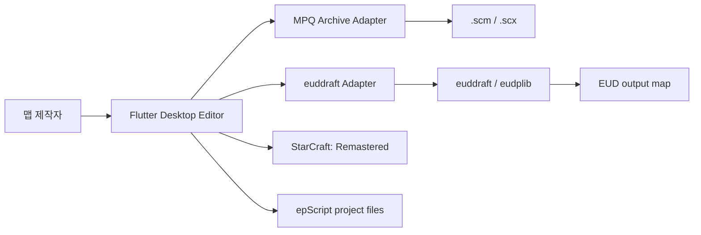
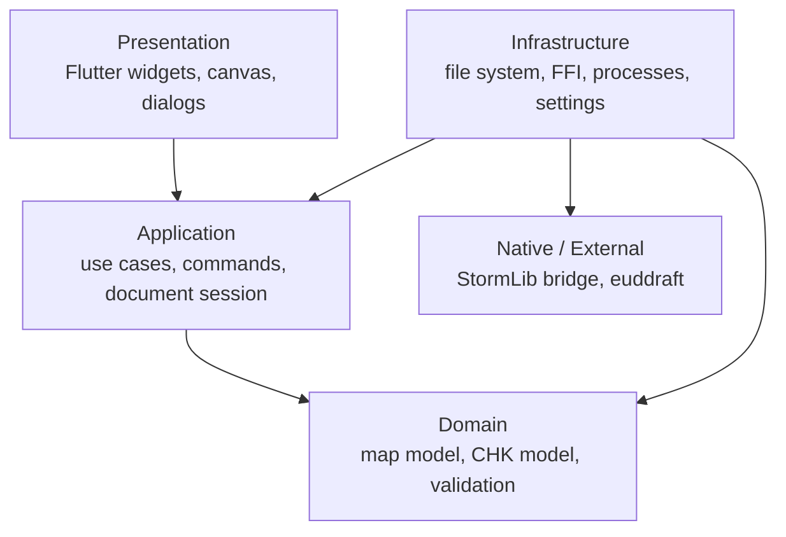
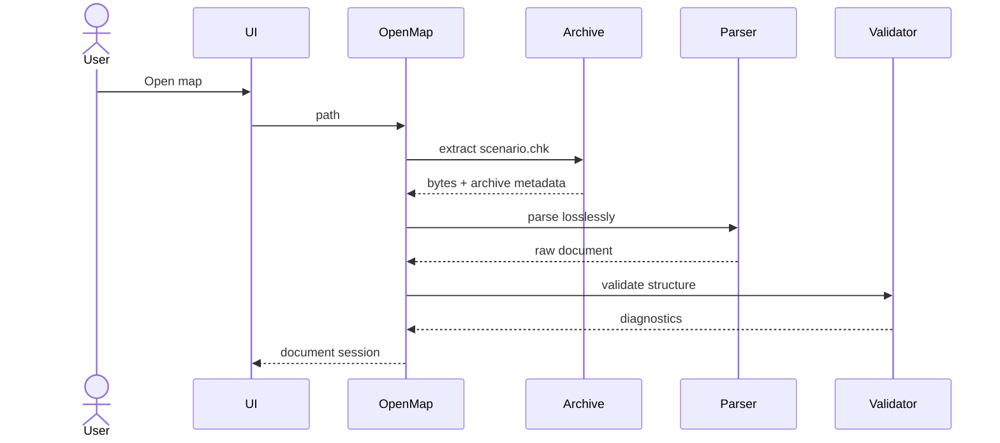

# 아키텍처

## 1. 목표와 제약

이 아키텍처는 다음 문제를 우선 해결한다.

- 바이너리 맵을 편집해도 알 수 없는 데이터가 사라지지 않아야 한다.
- Flutter UI가 MPQ, CHK, FFI, 외부 프로세스 세부사항에 묶이지 않아야 한다.
- EUD 도구가 교체되거나 버전이 바뀌어도 도메인과 UI 변경이 작아야 한다.
- 큰 맵과 빌드 작업이 UI 스레드를 막지 않아야 한다.
- 파일 입출력과 외부 코드 실행을 테스트에서 대체할 수 있어야 한다.

Windows와 StarCraft: Remastered를 우선 지원한다. 모바일과 웹 디렉터리는 Flutter 템플릿에 남아 있더라도 제품 대상이 아니다.

## 2. 시스템 컨텍스트



앱은 StarCraft 프로세스 메모리를 직접 수정하지 않는다. 게임 실행 연동은 생성된 맵을 테스트하기 위한 명시적 사용자 동작으로 제한한다.

## 3. 계층 구조



### Presentation

- 에디터 셸, 메뉴, 패널, 캔버스, Inspector
- 키보드/마우스 입력을 애플리케이션 명령으로 변환
- 도메인 객체를 직접 저장하거나 외부 프로세스를 실행하지 않음

### Application

- 맵 열기, Save As, 편집 명령, 빌드, 검증 유스케이스
- 문서 세션, 변경 여부, Undo/Redo, 작업 진행과 취소
- 포트 인터페이스 정의: 아카이브, 파일, 컴파일러, 설정, 로그

### Domain

- CHK 섹션과 맵 의미 모델
- 지원 섹션의 인코딩/디코딩과 검증
- 좌표, 플레이어, 유닛, 로케이션, 트리거 같은 값 객체
- Flutter, 파일 시스템, 프로세스, FFI에 의존하지 않음

### Infrastructure

- MPQ 네이티브 브리지
- 로컬 파일 시스템, 원자적 저장, 자동 백업
- euddraft 프로세스 실행과 진단 변환
- 설정과 최근 프로젝트 저장

## 4. 제안 디렉터리 구조

```text
lib/
  app/
    app.dart
    bootstrap.dart
  domain/
    chk/
    map/
    trigger/
    validation/
  application/
    documents/
    editing/
    build/
    operations/
    ports/
    recent_projects/
  infrastructure/
    archive/
    compiler/
    filesystem/
    settings/
  presentation/
    shell/
    map_canvas/
    inspector/
    trigger_editor/
    eud_editor/
native/
  map_bridge/
test/
  unit/
  integration/
  widget/
  fixtures/
docs/
```

실제 구현 중 더 단순한 구조로 시작할 수 있지만, 의존성 방향은 유지한다.

## 5. 핵심 모델

### RawChkDocument

파싱된 모든 섹션을 원래 순서대로 가진다.

```text
RawChkDocument
  sections: List<RawChkSection>

RawChkSection
  name: 4 raw bytes
  declaredLength: uint32
  payload: bytes
  sourceOffset: int
  dirty: bool
```

지원하지 않는 섹션과 중복 섹션도 삭제하지 않는다. 수정되지 않은 섹션은 가능한 경우 원본 헤더와 페이로드를 그대로 쓴다.

### MapDocument

편집 UI가 사용하는 의미 모델과 원시 문서를 묶는다.

```text
MapDocument
  sourceSnapshot
  rawChk
  metadata
  terrain
  entities
  locations
  players
  strings
  triggers
  diagnostics
```

의미 모델은 원시 데이터의 유일한 원본이 아니라 편집을 위한 투영이다. 저장할 때 변경된 의미 모델만 해당 CHK 섹션에 반영한다.

### DocumentSession

```text
DocumentSession
  documentId
  sourcePath
  sourceFingerprint
  document
  undoStack
  redoStack
  isDirty
  lastSave
  lastBuild
```

`sourceFingerprint`는 저장 전에 외부 변경을 감지하기 위해 크기, 수정 시각, 해시를 조합한다.

## 6. 명령과 Undo/Redo

모든 사용자 편집은 명시적인 명령으로 표현한다.

```dart
abstract interface class EditorCommand {
  String get label;
  void apply(MapDocument document);
  void revert(MapDocument document);
}
```

- 드래그처럼 이벤트가 많은 동작은 하나의 명령으로 병합한다.
- 선택 변경과 화면 이동은 문서 변경 기록에 넣지 않는다.
- 대량 삭제와 되돌릴 수 없는 변환은 실행 전 영향을 요약한다.
- 저장은 Undo 기록을 지우지 않고 저장 기준점만 갱신한다.

## 7. 포트 인터페이스

구체적인 이름은 구현 시 조정할 수 있지만 책임은 분리한다.

```dart
abstract interface class MapArchiveGateway {
  Future<ExtractedMap> open(String path);
  Future<void> writeAs(ArchiveWriteRequest request);
}

abstract interface class EudCompilerGateway {
  Future<EudToolInfo> inspect();
  Stream<BuildEvent> build(EudBuildRequest request);
}

abstract interface class SafeFileWriter {
  Future<VerifiedWriteResult> writeVerified(WriteRequest request);
}
```

테스트는 메모리 구현이나 가짜 프로세스 구현을 사용한다.

## 8. 주요 데이터 흐름

### 맵 열기



### 안전한 저장


검증 실패 시 임시 파일은 최종 출력으로 승격하지 않는다.

### EUD 빌드

기준 맵, 소스, 설정을 고정한 요청을 만들고 euddraft 어댑터가 별도 프로세스를 실행한다. 출력 맵은 성공 후 다시 열어 최소 구조를 검증한다. 자세한 내용은 [EUD 연동](EUD_INTEGRATION.md)을 따른다.

## 9. 동시성과 성능

- 바이너리 파싱/인코딩, 파일 해시, 큰 검증 작업은 Dart isolate 또는 네이티브 작업으로 분리한다.
- UI에는 단계와 진행률을 이벤트로 전달한다.
- 취소 가능한 작업과 취소 불가능한 커밋 단계를 구분한다.
- 캔버스는 전체 맵을 매 프레임 다시 그리지 않고 가시 영역과 레이어 캐시를 사용한다.
- 원시 파일 전체의 불필요한 복사를 줄이되, 최적화 전에 정확성과 테스트를 확보한다.

## 10. 오류 모델

사용자에게 표시되는 진단은 다음 정보를 가질 수 있다.

```text
Diagnostic
  severity: info | warning | error | fatal
  code: stable identifier
  message: localized summary
  stage: archive | parse | validate | edit | save | compile | launch
  filePath
  sectionName
  byteOffset
  sourceLine / sourceColumn
  remediation
  rawDetails
```

UI 메시지와 개발자 로그를 분리한다. 사용자 메시지는 해결 방법을 제공하고, 원시 예외와 스택은 로그에서 확인할 수 있게 한다.

## 11. 설정과 비밀정보

- 로컬 설정에는 StarCraft, euddraft, 작업 폴더 경로가 포함될 수 있다.
- Windows 사용자 설정과 최근 맵 목록은
  `%LOCALAPPDATA%\blackvrice\StarCraftMapEditor\settings.json`에 저장한다.
- 설정은 소스 저장소나 프로젝트 파일에 자동으로 커밋하지 않는다.
- 토큰이나 계정 자격 증명은 이 프로젝트의 초기 기능에 필요하지 않다.
- 로그를 공유할 때 개인 경로를 가릴 수 있어야 한다.

## 12. 기술 결정 상태

| 결정 | 상태 | 기록 |
| --- | --- | --- |
| Windows/SC:R 우선 | 승인 | [ADR-0001](decisions/0001-windows-remastered-first.md) |
| CHK 원시 섹션 무손실 보존 | 승인 | [ADR-0002](decisions/0002-lossless-chk-model.md) |
| EUD 컴파일러를 외부 프로세스로 격리 | 승인 | [ADR-0003](decisions/0003-external-euddraft-adapter.md) |
| MPQ 브리지 구현 방식 | 검토 필요 | StormLib FFI와 helper process 비교 필요 |
| 프로젝트 파일 형식 | 검토 필요 | EUD 수직 기능 구현 전 결정 |
