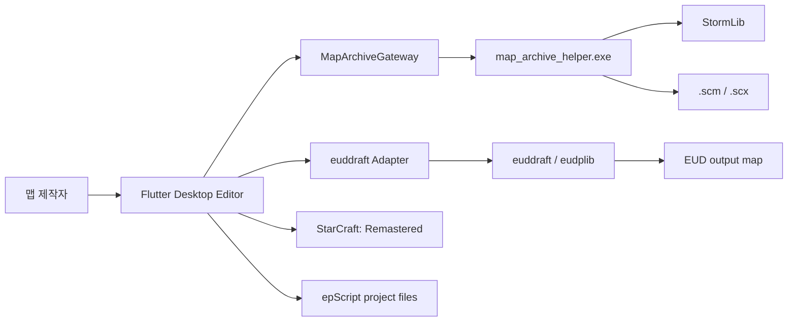
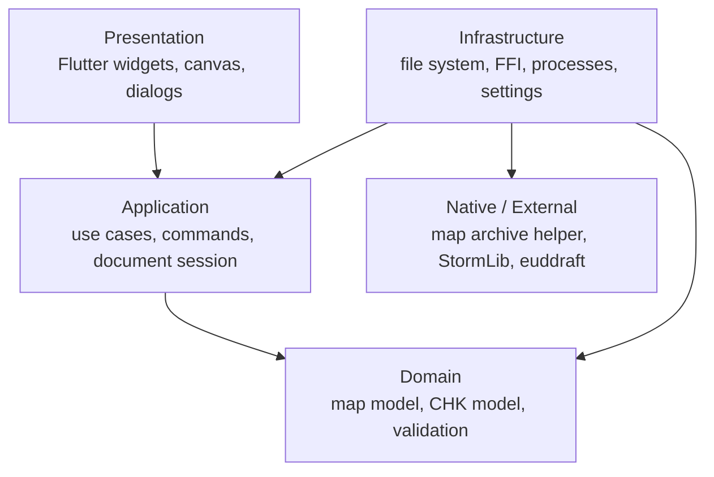
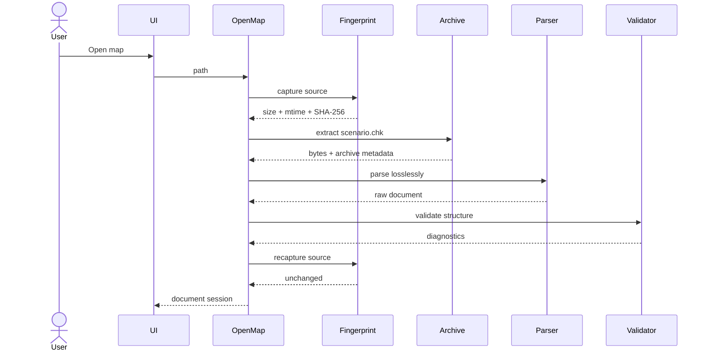
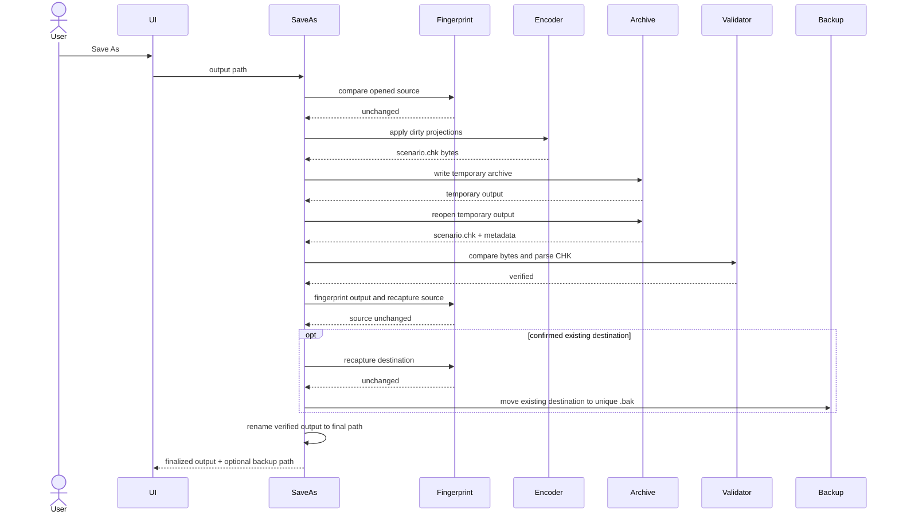

# 아키텍처

## 1. 목표와 제약

이 아키텍처는 다음 문제를 우선 해결한다.

- 바이너리 맵을 편집해도 알 수 없는 데이터가 사라지지 않아야 한다.
- Flutter UI가 MPQ, CHK, FFI, 외부 프로세스 세부사항에 묶이지 않아야 한다.
- EUD 도구가 교체되거나 버전이 바뀌어도 도메인과 UI 변경이 작아야 한다.
- 큰 맵과 빌드 작업이 UI 스레드를 막지 않아야 한다.
- 파일 입출력과 외부 코드 실행을 테스트에서 대체할 수 있어야 한다.

Windows와 StarCraft: Remastered를 우선 지원한다. 모바일과 웹 디렉터리는 Flutter 템플릿에 남아 있더라도 제품 대상이 아니다.

## 2. 시스템 컨텍스트



앱은 StarCraft 프로세스 메모리를 직접 수정하지 않는다. 게임 실행 연동은 생성된 맵을 테스트하기 위한 명시적 사용자 동작으로 제한한다.

## 3. 계층 구조



### Presentation

- 에디터 셸, 메뉴, 패널, 캔버스, Inspector
- 키보드/마우스 입력을 애플리케이션 명령으로 변환
- 도메인 객체를 직접 저장하거나 외부 프로세스를 실행하지 않음

### Application

- 맵 열기, Save As, 편집 명령, 빌드, 검증 유스케이스
- 문서 세션, 변경 여부, Undo/Redo, 작업 진행과 취소
- 포트 인터페이스 정의: 아카이브, 파일, 컴파일러, 설정, 로그

### Domain

- CHK 섹션과 맵 의미 모델
- 지원 섹션의 인코딩/디코딩과 검증
- 좌표, 플레이어, 유닛, 로케이션, 트리거 같은 값 객체
- Flutter, 파일 시스템, 프로세스, FFI에 의존하지 않음

### Infrastructure

- `MapArchiveGateway`와 번들된 MPQ helper process 어댑터
- 로컬 파일 시스템, 원자적 저장, 자동 백업
- euddraft 프로세스 실행과 진단 변환
- 설정과 최근 프로젝트 저장

## 4. 제안 디렉터리 구조

```text
lib/
  app/
    app.dart
    bootstrap.dart
  domain/
    chk/
    map/
    trigger/
    validation/
  application/
    documents/
    editing/
    eud/
    operations/
    ports/
    recent_projects/
  infrastructure/
    archive/
    compiler/
    filesystem/
    settings/
  presentation/
    shell/
    map_canvas/
    inspector/
    trigger_editor/
    eud_editor/
native/
  map_archive_helper/
test/
  unit/
  integration/
  widget/
  fixtures/
docs/
```

실제 구현 중 더 단순한 구조로 시작할 수 있지만, 의존성 방향은 유지한다.

## 5. 핵심 모델

### RawChkDocument

파싱된 모든 섹션을 원래 순서대로 가진다.

```text
RawChkDocument
  sections: List<RawChkSection>

RawChkSection
  name: 4 raw bytes
  declaredLength: uint32
  payload: bytes
  sourceOffset: int
  dirty: bool
```

지원하지 않는 섹션과 중복 섹션도 삭제하지 않는다. 수정되지 않은 섹션은 가능한 경우 원본 헤더와 페이로드를 그대로 쓴다.

### ChkTerrainTileMapView

`MTXM`의 2바이트 little-endian 값을 원시 타일 배열로 투영한다. 정확히 하나의
유효한 `DIM `이 있을 때만 폭·높이를 결합해 2차원 좌표 접근을 제공하며,
중복 `MTXM`은 원래 순서와 섹션 인덱스를 유지한다. 편집 메서드는 배열 길이를
바꾸지 않고 대상 raw 섹션만 dirty 복제본으로 반환한다. `TILE`과 `ISOM`은
우선순위와 재생성 규칙을 검증하기 전까지 raw-only다.

### MapDocument

편집 UI가 사용하는 의미 모델과 원시 문서를 묶는다.

```text
MapDocument
  sourceSnapshot
  rawChk
  metadata
  terrain
  entities
  locations
  players
  strings
  triggers
  diagnostics
```

의미 모델은 원시 데이터의 유일한 원본이 아니라 편집을 위한 투영이다. 저장할 때 변경된 의미 모델만 해당 CHK 섹션에 반영한다.

### DocumentSession

```text
DocumentSession
  documentId
  sourcePath
  sourceFingerprint
  document
  terrainViews
  undoStack
  redoStack
  isDirty
  lastSave
  lastBuild
```

`sourceFingerprint`는 외부 변경을 감지하기 위해 파일 크기, UTC 수정 시각,
SHA-256을 조합한다. 현재 `OpenedMapSession`은 열기 전후 fingerprint가 같을
때만 생성되고 Save As로 채택한 세션은 검증된 임시 출력의 fingerprint를
이어받는다. Open/Save 재검증은 `ChkMetadataViews`와 `ChkTerrainViews`를
동시에 생성하고 두 계층의 구조 진단을 세션에 포함한다.

### MapCanvas

`presentation/map_canvas`의 `MapCanvasLayout`은 viewport와 `DIM ` 타일 크기로
fit-to-view 기준 타일 크기, 카메라 배율·이동, 화면상의 맵 경계, 가시 타일
범위와 격자 간격을 계산한다.
`MapCanvasPainter`는 viewport를 clip하고 가시 `MTXM` 타일만 원시 값 기반
대체 색상으로 그린 뒤 적응형 격자와 명확한 맵 외곽선을 겹친다.

`MapCanvas`의 카메라 상태는 Presentation에만 존재하며 맵 문서의 Undo/Redo나
dirty 상태에 포함하지 않는다. 휠 확대는 포인터 아래 맵 좌표를 고정하고,
`Space`+좌클릭과 중간 버튼 이동은 확대된 맵을 viewport 가장자리 안에서
제한한다. 레이아웃은 포인터 화면 위치를 0기준 타일 좌표와 타일당 32픽셀인
StarCraft 맵 픽셀 좌표로 역변환한다. StarCraft 실제 타일 이미지는 데이터
자산 경로와 누락 진단이 구현될 때 대체 색상 렌더러를 교체한다.

## 6. 명령과 Undo/Redo

모든 사용자 편집은 명시적인 명령으로 표현한다.

```dart
abstract interface class EditorCommand {
  String get label;
  void apply(MapDocument document);
  void revert(MapDocument document);
}
```

- 드래그처럼 이벤트가 많은 동작은 하나의 명령으로 병합한다.
- 선택 변경과 화면 이동은 문서 변경 기록에 넣지 않는다.
- 대량 삭제와 되돌릴 수 없는 변환은 실행 전 영향을 요약한다.
- 저장은 Undo 기록을 지우지 않고 저장 기준점만 갱신한다.

## 7. 포트 인터페이스

구체적인 이름은 구현 시 조정할 수 있지만 책임은 분리한다.

```dart
abstract interface class MapArchiveGateway {
  Future<MapArchiveOpenResult> open(MapArchiveOpenRequest request);
  Future<MapArchiveWriteResult> writeTemporary(
    MapArchiveWriteRequest request,
  );
  Future<bool> cancel(String operationId);
}

abstract interface class EudToolInspector {
  Future<EudToolInspectionResult> inspect(
    EudToolInspectionRequest request,
  );
}

abstract interface class EudCompilerGateway {
  Stream<EudBuildEvent> build(EudBuildRequest request);
  Future<bool> cancel(String buildId);
}

abstract interface class EudBuildGateway {
  Stream<EudBuildEvent> build(EudBuildPlan plan);
  Future<bool> cancel(String buildId);
}

abstract interface class EudBuildFileGateway {
  Future<void> validateInputs(EudBuildConfiguration configuration);
  Future<EudBuildWorkspace> createWorkspace(
    EudBuildConfiguration configuration,
  );
  Future<EudBuildPromotionResult> promote(...);
  Future<void> cleanup(EudBuildWorkspace workspace);
}

abstract interface class SafeFileWriter {
  Future<VerifiedWriteResult> writeVerified(WriteRequest request);
}

abstract interface class MapFilePicker {
  Future<String?> pickMapPath();
}

abstract interface class MapFileFingerprintGateway {
  Future<MapFileFingerprint> fingerprint(String path);
}
```

테스트는 메모리 구현이나 가짜 프로세스 구현을 사용한다.

`EudBuildConfiguration`은 euddraft 호출보다 앞선 Application 계층 모델이다.
현재 `scr-euddraft` 프로필, 기준 `.scm/.scx`, 소스 루트와 진입 `.eps`, 새
`.scx` 출력, 선택적 프로젝트 도구 경로, 컴파일러 옵션과 환경 override를
불변 값으로 보관한다. Windows 절대 경로와 안전한 경로 세그먼트를 요구하고,
진입 소스가 소스 루트 안에 있으며 출력은 기준 맵 및 소스 트리와 분리되도록
어휘적으로 검증한다.

`EudSourceDocument`는 epScript 텍스트, 저장 기준선, revision과 선택적 절대
`.eps` 경로를 가진 불변 스냅샷이다. dirty 상태는 별도 플래그를 임의로
토글하지 않고 현재 텍스트와 저장 기준선의 차이로 계산한다.
`EudSourceController`는 새 메모리 문서, 열린 파일 스냅샷, 텍스트 변경,
저장 기준선 갱신과 dirty 문서 교체·닫기 거부를 Application 계층에서
관리한다. Presentation은 이 상태를 구독하고 실제 파일 I/O는 후속 포트가
담당한다.

`EudToolInspector`는 프로젝트 프로필, 사용자 설정, 번들 경로 후보의 우선순위와
euddraft 설치 무결성을 Application 계층 계약으로 노출한다.
`LocalEudToolInspector`는 절대 경로의 디렉터리 또는 `euddraft.exe`만 받아
실행 없이 sibling `VERSION`과 공식 배포 companion 파일을 확인한다. 지원
버전은 검증된 exact allowlist이며, 잘못된 상위 우선순위 경로를 낮은 우선순위
설치로 조용히 대체하지 않는다.

`EudCompilerGateway`는 검사 완료된 도구, 절대 `.eds` 설정 경로, timeout과
명시적 환경 변수 override만 받는다. `ProcessEudCompilerGateway`는 설정 파일
부모를 작업 디렉터리로 삼고 셸 없이 euddraft를 실행한다. stdin은 즉시
닫으며 stdout/stderr를 UTF-8 줄 이벤트로 동시에 전달한다. 종료 코드 0은
프로세스 단계 성공일 뿐이며 출력 파일 검사와 최종 승격은 이후 Application
파이프라인 책임이다.

`SafeEudBuildPipeline`은 상위 `EudBuildGateway` 구현이며
`EudCompilerGateway`의 프로세스 성공을 그대로 노출하지 않는다. 도구 재검사,
입력·소스·기존 출력 fingerprint, 일회성 `.eds`, 임시 출력 재열기와 CHK 최소
구조 검증, 경합 재확인 및 rename 승격을 조정한다. 이 파이프라인의
`succeeded`만 전체 빌드 성공을 뜻한다.

`EudBuildController`는 준비된 단일 `EudBuildPlan`과 상위 게이트웨이 이벤트
스트림을
`ready/running/cancelling/finalizing/succeeded/failed/cancelled` 상태로
조립한다. 같은 `OperationProgressController`에 컴파일과 검증 단계를
게시하고, Build 중복 실행을 차단하며 취소는 컴파일 중인 활성 build ID로만
전달한다. 이벤트 스트림 오류, 결과 없는 종료와 build ID 불일치는 구조화
진단을 가진 실패로 종결한다. Presentation은 이 상태만 구독해 Build/Cancel
활성 상태와 현재 세션의 빌드 기록을 표시한다.

`EudCompilerDiagnosticParser`는 Application 계층이 소유하는 선택적 변환
포트다. Infrastructure의 `EuddraftDiagnosticParser`는 공식 epScript
컴파일러가 stderr에 내보내는 구조화된 오류 한 줄만 인식하고
`EditorDiagnostic`의 코드·파일·행으로 변환한다. 알 수 없는 줄, stdout의
유사 문자열, 현재 형식이 제공하지 않는 열은 추정하지 않는다. 컨트롤러는
원시 줄을 먼저 기록한 뒤 파서가 반환한 진단을 별도 이벤트로 추가하므로
어댑터의 해석 가능 범위와 관계없이 원본 증거가 유지된다.

각 실행은 `EudBuildRecord` 불변 스냅샷으로 남는다. build ID, 실제 euddraft
버전, UTC 시작·종료 시각, 실행 상태, 선택적 종료 코드, 순서를 유지한
`stdout`/`stderr` 줄과 구조화 진단을 가진다. 로그 줄에는 채널과 캡처 시각이
붙으며 성공 기록은 종료 코드 0을 강제한다. 컨트롤러는 실행 중 마지막 기록을
교체하고 완료 후에도 기본 20개의 최근 기록을 유지해 재시도 설정이 준비되어도
직전 결과를 잃지 않는다.

원시 도구 출력에는 개인 경로나 토큰이 포함될 수 있으므로 이 기록은 현재
세션 메모리에만 둔다. 디스크 manifest, 앱·프로필·eudplib 버전과 개인정보
제거본 내보내기는 후속 작업이다.

컨트롤러는 임의의 기본 경로나 설정을 만들지 않는다. 프로젝트 설정 흐름이
검사된 도구와 `EudBuildConfiguration`을 가진 `EudBuildPlan`을 `prepare`하기
전에는 Build 명령이 비활성 상태다. `.eds`와 임시 출력은 Build 동작 시
`LocalEudBuildFileGateway`가 최종 출력의 형제 작업 공간에 만들고 종료 경로
마다 정확히 그 앱 소유 디렉터리만 정리한다.

어댑터는 Windows 기본 환경 변수 중 실행에 필요한 allowlist만 상속하고,
스트림마다 기본 1 MiB까지만 메모리에 전달한다. 초과분도 프로세스 종료까지
소비해 파이프 교착을 막지만 빌드는 실패시킨다. timeout, 명시적 취소와
스트림 구독 취소는 프로세스를 종료하며 스트림별 소유 토큰으로 같은 ID의
다른 요청을 취소하지 못하게 한다.

`MapFilePicker`는 사용자가 선택한 절대 경로 또는 취소를 뜻하는 `null`만
Application 계층에 반환한다. Windows의 `GetOpenFileNameW`/
`GetSaveFileNameW`와 Flutter method channel 세부사항은 Infrastructure와
runner에 남고 Presentation은 Open Map/Save As 명령만 전달한다. 기존 Save As
대상은 Windows `OFN_OVERWRITEPROMPT` 승인을 통과한 경우에만 포트가 반환한다.

`MapSaveFileGateway`는 최종 경로 존재 여부와 경로 동일성 확인, 최종 경로의
같은 디렉터리에 앱 소유 임시 작업 공간 생성, 검증된 파일의 rename 승격,
기존 출력의 고유 복구 백업과 정확한 작업 공간 정리를 추상화한다. 현재 정책은
열린 원본을 교체하지 않는다. 명시적으로 승인된 다른 기존 출력은 같은
디렉터리의 `.bak` 경로로 먼저 이동하고, 검증된 출력을 승격한다. 승격 실패 시
백업을 자동 복원하며 복원도 실패하면 백업 경로를 예외 계약으로 반환한다.
백업은 작업 공간 밖에 있어 cleanup 대상이 아니다.

`MapFileFingerprintGateway`는 Application 계층에 경로 독립적인 파일
fingerprint만 반환한다. Infrastructure의 로컬 구현은 해시 전후 `stat`이
일치하는 일반 파일에 한해 SHA-256을 스트리밍 계산한다. 파일이 사라지거나
계산 중 크기·수정 시각이 바뀌면 fingerprint를 반환하지 않는다.

`MapArchiveGateway` 포트는 Application 계층의 계약만 표현한다. open 요청은
operation ID, 원본 경로, timeout을 가지며 성공 결과는 추출된 CHK 바이트와
아카이브 메타데이터를 함께 반환한다. 임시 쓰기 요청은 원본 경로와 서로 다른
앱 소유 임시 출력 경로를 요구한다. 결과 모델은 다음 불변식을 강제한다.

- 바이너리 요청과 결과는 0~255 범위를 검사한 뒤 방어적으로 복사하며,
  메타데이터 목록과 함께 읽기 전용 값으로 노출한다.
- 추출 성공에는 정확히 하나의 `staredit\scenario.chk` 메타데이터가 있고
  선언된 비압축 크기와 반환 바이트 길이가 같아야 한다.
- 성공 결과에는 저장을 차단하는 진단이 없고 실패 결과에는 최소 하나의
  차단 진단이 있어야 한다.
- timeout은 명시적인 양수이며 취소는 Application operation ID로 요청한다.
- 포트에는 helper 실행 파일, JSON 프로토콜, StormLib 타입이 노출되지 않는다.

### MapArchiveGateway 구현 경계

`MapArchiveGateway`의 StormLib 연동은
[ADR-0004](decisions/0004-stormlib-helper-process.md)에 따라 번들된
`map_archive_helper.exe`를 요청마다 별도 프로세스로 실행한다.

- 앱은 절대 경로의 helper를 셸 없이 실행하고 버전이 있는 UTF-8 JSON 요청을
  줄바꿈으로 끝나는 단일 stdin 레코드로 전달한다. helper는 EOF를 기다리지 않고
  첫 줄을 받은 즉시 처리한다.
- 현재 helper는 `extractScenario`, `replaceScenario`만 제공하며 MVP에서
  접근 가능한 항목은 정확히 `staredit\scenario.chk`다.
- 바이너리 CHK는 앱 소유 요청별 임시 디렉터리의 파일로 교환한다.
- stdout의 구조화 응답과 stderr를 동시에 소비하고 종료 코드, 프로토콜,
  최종 응답을 모두 확인한다.
- 입력 fingerprint, CHK/출력 재검증, 최종 승격은 Application 계층이 소유한다.
  helper는 원본을 제자리 수정하거나 최종 출력 경로를 승격하지 않는다.
- timeout, 취소, 네이티브 크래시는 작업 실패로 변환하고 앱이 만든 정확한
  임시 디렉터리만 정리한다.

2026-07-27 구현 기준선:

- `native/map_archive_helper`는 고정된 StormLib revision을 정적으로 링크하고
  `extractScenario`와 `replaceScenario` 프로토콜을 제공한다. 추출 원본은
  `MPQ_OPEN_READ_ONLY`로 열고, 교체는 원본을 새 임시 MPQ로 복사한 뒤 복사본의
  `scenario.chk`만 바꾼다. 기존 CHK/MPQ 출력 파일을 덮어쓰지 않는다.
- `ProcessMapArchiveGateway`는 요청별 임시 디렉터리를 만들고 helper와
  `protocolVersion=1` JSON으로 통신한다. 성공 응답의 request ID, 작업,
  helper/StormLib 버전, 메타데이터와 실제 추출 파일 크기를 모두 검증한다.
- helper `0.4.0`은 StormLib 내부 listfile과 파일 테이블을 이용해 최대
  1,024개 항목을 열거한다. 응답에는 MPQ format version, 전체 항목 수,
  목록 완전성, 항목별 경로·압축/비압축 크기·flags·locale·합성 이름 여부가
  포함된다. 동일 block index의 locale hash 항목은 한 번만 노출한다. 기본
  locale의 `scenario.chk`가 1,200바이트 이하인 eudplib placeholder이면
  locale `0x0409`의 실제 CHK를 재시도하고 선택한 locale을 응답에 기록한다.
- Dart 어댑터는 전체 수와 목록 수, 선택된 locale의 `scenario.chk` 항목과
  추출 메타데이터를 교차 검증한다. locale이 다른 같은 경로 항목은 보존한다.
  불완전 목록, 합성 이름, 중복 경로, 예상 밖 MPQ 버전은 성공 결과의 비차단
  경고이며, 내부 MPQ 관리 파일이 아닌 암호화 항목은 정보 진단이다.
- helper stdin은 64 KiB, Dart가 보존하는 stdout/stderr는 스트림별 1 MiB,
  추출 CHK는 기본 64 MiB로 제한한다. 출력 스트림은 제한을 넘은 뒤에도
  버리면서 끝까지 소비해 파이프 교착을 막는다.
- timeout과 operation ID 취소는 helper 프로세스를 종료한다. 임시 쓰기는
  CHK 입력과 MPQ 출력이 같은 앱 소유 작업 디렉터리에 있는지, helper 응답의
  CHK/아카이브 크기와 실제 파일이 일치하는지 검증한다.
- `OpenMapController`는 helper 호출 전후 원본 fingerprint를 비교하고,
  `SaveMapController`는 저장 시작과 최종 승격 직전에 세션 원본 fingerprint를
  비교한다. 불일치나 읽기 실패는 구조화 진단과 작업 실패가 되며 임시 출력은
  승격되지 않는다.

## 8. 주요 데이터 흐름

### 맵 열기



2026-07-26 기준 `OpenMapController`가 이 흐름의 Application 조정자다. 새 파일
열기는 `MapFilePicker`로 경로를 고르고 최근 파일 열기는 저장된 경로를 직접
사용하지만, 이후에는 동일하게 `MapArchiveGateway` → `RawChkParser` →
`ChkMetadataViewDecoder`를 거친다. raw 구조를 파싱할 수 없으면 기존 세션을
유지한 채 실패 진단을 반환한다. typed 메타데이터 오류는 원시 문서를 보존한
제한 읽기 전용 세션으로 열며, 성공한 경로만 최근 파일에 기록한다. 원본
fingerprint가 열기 전후 다르거나 어느 시점에든 읽을 수 없으면 새 세션과 최근
파일 기록을 만들지 않는다.

### 안전한 저장



2026-07-26 기준 `SaveMapController`가 이 흐름을 조정한다. 원본과 같은 경로와
지원하지 않는 확장자를 먼저 거부한다. 기존의 다른 최종 경로는 사용자가
Windows Save As 확인을 승인한 경우에만 허용한다. 최종 경로와 같은 디렉터리에
만든 임시 작업 공간에서만 helper를 실행하고, 재열기 CHK가 인코딩 바이트와
정확히 같으며 raw 파싱에 성공한 뒤에만 최종 경로로 rename한다. 성공 시 검증된
출력을 현재 문서 세션과 최근 파일로 채택하고, 교체한 파일의 백업 경로는 저장
상태와 정보 진단으로 반환한다.

저장 시작과 승격 직전에 원본과 기존 출력의 fingerprint를 각각 비교한다.
처음 없던 출력의 생성도 충돌로 처리한다. 기존 출력은 고유 `.bak`로 이동한 뒤
승격하며 실패하면 자동 복원한다. 자동 복원 실패 시 백업은 보존되고 별도의
복구 필요 진단을 반환한다. 다른 검증 실패에서는 임시 파일을 승격하지 않는다.

### EUD 빌드

먼저 `EudBuildConfiguration`이 기준 맵, 소스 루트와 진입점, 별도 출력 경로와
프로필을 고정한다. 이 모델이 만든 검사 요청으로 `EudToolInspector`가 선택된
설치의 경로, 지원 버전과 companion 파일을 검증한다. `SafeEudBuildPipeline`은
Build 직전 설치를 다시 검사하고 설정을 임시 `.eds`로 직렬화해 euddraft
어댑터를 별도 프로세스로 실행한다. 프로세스 종료 코드 0 뒤 출력 맵을 다시
열어 MPQ/CHK 최소 구조, 입력·소스·기존 출력 불변성을 검증한 뒤에만 최종
경로로 승격한다. 자세한 내용은 [EUD 연동](EUD_INTEGRATION.md)을 따른다.

## 9. 동시성과 성능

- 바이너리 파싱/인코딩, 파일 해시, 큰 검증 작업은 Dart isolate 또는 네이티브 작업으로 분리한다.
- UI에는 단계와 진행률을 이벤트로 전달한다.
- 취소 가능한 작업과 취소 불가능한 커밋 단계를 구분한다.
- 캔버스는 전체 맵을 매 프레임 다시 그리지 않고 가시 영역과 레이어 캐시를 사용한다.
- 원시 파일 전체의 불필요한 복사를 줄이되, 최적화 전에 정확성과 테스트를 확보한다.

## 10. 오류 모델

사용자에게 표시되는 진단은 다음 정보를 가질 수 있다.

```text
Diagnostic
  severity: info | warning | error | fatal
  code: stable identifier
  message: localized summary
  stage: archive | parse | validate | edit | save | compile | launch
  filePath
  sectionName
  byteOffset
  sourceLine / sourceColumn
  remediation
  rawDetails
```

UI 메시지와 개발자 로그를 분리한다. 사용자 메시지는 해결 방법을 제공하고, 원시 예외와 스택은 로그에서 확인할 수 있게 한다.

## 11. 설정과 비밀정보

- 로컬 설정에는 StarCraft, euddraft, 작업 폴더 경로가 포함될 수 있다.
- Windows 사용자 설정과 최근 맵 목록은
  `%LOCALAPPDATA%\blackvrice\StarCraftMapEditor\settings.json`에 저장한다.
- 설정은 소스 저장소나 프로젝트 파일에 자동으로 커밋하지 않는다.
- 토큰이나 계정 자격 증명은 이 프로젝트의 초기 기능에 필요하지 않다.
- 로그를 공유할 때 개인 경로를 가릴 수 있어야 한다.

## 12. 기술 결정 상태

| 결정 | 상태 | 기록 |
| --- | --- | --- |
| Windows/SC:R 우선 | 승인 | [ADR-0001](decisions/0001-windows-remastered-first.md) |
| CHK 원시 섹션 무손실 보존 | 승인 | [ADR-0002](decisions/0002-lossless-chk-model.md) |
| EUD 컴파일러를 외부 프로세스로 격리 | 승인 | [ADR-0003](decisions/0003-external-euddraft-adapter.md) |
| MPQ 브리지 구현 방식 | 승인 | [ADR-0004](decisions/0004-stormlib-helper-process.md) |
| 프로젝트 파일 형식 | 검토 필요 | EUD 수직 기능 구현 전 결정 |
