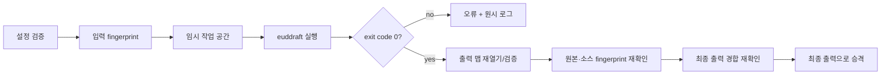

# EUD 연동

## 1. 목표

앱 안에서 epScript를 편집하고 euddraft/eudplib를 이용해 StarCraft: Remastered용 EUD 맵을 빌드한다. 컴파일러 자체를 재구현하지 않고 안정적인 어댑터를 제공한다.

현재 구현된 EUD 기능은 코드 중심이다. M6.3.1에서는 유닛·무기 설정 UI에서
선언적 EUD 설정을 만들고 기존 빌드 경계에 연결한다. 시각적 블록 편집,
메모리 오프셋 탐색기, 런타임 디버거는 계속 장기 후보로 둔다.

## 2. 외부 도구 선택

- [eudplib](https://github.com/armoha/eudplib)은 맵 열기, CHK 추출, EUD 트리거 생성과 epScript를 제공한다.
- [euddraft](https://github.com/armoha/euddraft)는 eudplib 코드와 플러그인을 맵에 적용하는 배포 도구이며 해당 fork는 StarCraft: Remastered 기능에 초점을 둔다.

초기 구현은 euddraft를 **별도 프로세스**로 실행한다. 앱과 Python 런타임을 같은 프로세스에 임베드하지 않는다.

## 3. 지원 프로필

첫 프로필은 다음과 같다.

```text
profile: scr-euddraft
game: StarCraft: Remastered
language: epScript
compiler: armoha/euddraft
input: unprotected .scm/.scx
output: a new .scx path
```

1.16.1 호환 프로필은 별도 도구와 오프셋 검증이 필요하므로 초기 범위에서 제외한다.

## 4. 작업 공간 모델

프로젝트 파일 형식이 확정되기 전까지 구현된 Application 모델은 다음 정보를
표현한다.

```text
EudBuildConfiguration
  baseMapPath
  sourceRootPath
  entrySourcePath
  outputMapPath
  compilerProfile
  compilerPathOverride?
  compilerOptions
  environmentOverrides
```

첫 `EudCompilerProfile`은 `scr-euddraft`이며 입력 맵 `.scm/.scx`, 진입 소스
`.eps`, 출력 `.scx`를 요구한다. 모델 생성 시 다음 불변식을 적용한다.

- 모든 파일과 디렉터리 경로는 drive 또는 UNC 형식의 Windows 절대 경로다.
- 장치 경로, `.`/`..`, Windows 예약 장치 이름과 금지 문자, 바깥 공백,
  끝 공백·점이 있는 세그먼트를 거부한다.
- 진입 소스는 소스 루트 내부에 있어야 한다.
- 출력 맵은 기준 맵과 다른 경로이며 소스 트리 밖에 있어야 한다.
- 컴파일러 옵션과 환경 override는 방어적으로 복사한 읽기 전용 값이다.
- 옵션 키와 환경 변수 이름/값은 설정 또는 프로세스 경계를 깨는 문자를
  거부한다.

이 검증은 파일 시스템에 접근하지 않는 어휘적 경계다. 파일 존재, 일반 파일
여부, symbolic link와 canonical 경로 동일성, 작업 중 fingerprint는
`SafeEudBuildPipeline`과 `LocalEudBuildFileGateway`가 실행 직전에 다시
검증한다. `compilerOptions`는 앱 소유 작업 공간의 `.eds` `[main]` 설정에
직렬화하며 euddraft 명령줄 인자로 직접 전달하지 않는다. 안전 파이프라인이
관리하는 `input`과 `output` 키는 사용자 옵션으로 덮어쓸 수 없다.

현재 MVP는 같은 설정에 `[freeze]`와 `freeze: 0`을 고정해 euddraft의 기본
Freeze 보호를 끈다. Freeze가 적용된 CHK는 의도적으로 일반 섹션 경계를
숨기므로 종료 코드 뒤의 raw CHK/메타데이터 재검증과 편집기 재열기 계약을
만족하지 않는다. 보호된 최종 배포 출력은 별도 신뢰·검증 흐름을 설계하기
전까지 지원하지 않는다.

권장 사용자 폴더 예시:

```text
MyMap/
  base/
    MyMap.scx
  src/
    main.eps
  build/
    MyMap-eud.scx
  logs/
```

`base` 입력은 불변으로 취급한다. `build`는 재생성 가능한 출력이며 중요한 원본을 두는 위치로 사용하지 않는다.

## 5. 도구 탐색과 버전

도구 경로는 다음 우선순위로 결정한다.

1. 프로젝트에 명시된 프로필 경로
2. 사용자 설정의 euddraft 경로
3. 향후 앱과 함께 배포되는 검증된 도구

명시된 상위 우선순위 경로가 잘못되었으면 낮은 우선순위 설치로 자동
우회하지 않는다. 사용자가 의도한 도구와 다른 바이너리를 실행하는 일을 막기
위해 해당 경로의 오류를 그대로 진단한다. 경로는 공식 ZIP을 푼 디렉터리 또는
그 안의 `euddraft.exe` 절대 경로로 지정한다. `PATH` 검색은 하지 않는다.

자동으로 인터넷에서 실행 파일을 내려받아 실행하지 않는다. 앱은 사용 전에 다음을 확인한다.

- 실행 파일 또는 진입점 존재
- 버전 정보 또는 배포 식별자
- 필요한 companion 파일 존재
- 지원 프로필과의 호환성

2026-07-27 확인 기준 armoha/euddraft의 최신 공식 릴리스는
[`0.10.2.5`](https://github.com/armoha/euddraft/releases/tag/v0.10.2.5)이며
ZIP 배포 루트에는 `euddraft.exe`, `VERSION`,
`libepScriptLib.dll`, Python 런타임과 `lib/`가 함께 있다. 현재
`LocalEudToolInspector`는 도구를 실행하지 않고 다음을 정적으로 확인한다.

- `VERSION`의 최대 크기 64바이트와 정확한 4성분 버전 형식
- exact allowlist `0.10.2.5`
- 0바이트가 아닌 `euddraft.exe`
- `libepScriptLib.dll`, `python3.dll`, 버전별 `python3<runtime>.dll`
- `lib/library.zip`, `lib/eudplib.bindings._rust.pyd`, `license.txt`
- 일반 파일/디렉터리만 허용하고 symbolic link는 companion으로 인정하지 않음

다른 버전은 존재와 버전 자체는 진단할 수 있지만 빌드를 허용하지 않는다.
지원 범위를 넓힐 때에는 해당 릴리스 레이아웃과 실제 빌드 스모크 테스트를 먼저
추가한다. euddraft 소스 실행은 이 단계의 지원 설치로 취급하지 않는다.

공식 [`0.10.2.5` 진입점](https://github.com/armoha/euddraft/blob/v0.10.2.5/euddraft.py#L105-L125)은
시작할 때 자체 업데이트 검사를 호출한다. 앱이 실행 파일을 자동 다운로드하지
않는 정책과 별개로 외부 도구 자체가 네트워크와 설치 디렉터리에 접근할 수
있으므로, 빌드 확인 화면에 이 동작을 알리고 매 빌드 직전에 설치를 다시
검사한다. 향후 번들 배포는 자동 업데이트를 끄거나 격리하는 별도 정책이
필요하다.

현재 프로세스 기록은 euddraft 버전, UTC 시작·종료 시각, 종료 코드와 원시
로그를 남긴다. 출력 승격 단계의 영구 manifest에는 앱 버전, eudplib 버전과
프로필까지 추가한다.

## 6. 프로세스 경계

### 실행 규칙

- 셸을 거치지 않고 executable과 argument list를 분리해 실행한다.
- `euddraft.exe <absolute-settings.eds>` 형식의 단발 실행만 허용한다.
- 설정 파일 부모를 작업 디렉터리로 명시한다.
- stdin을 즉시 닫아 예상치 못한 입력 대기를 막는다.
- stdout과 stderr를 동시에 소비하고 UTF-8 줄 이벤트로 전달한다. 잘못된
  UTF-8 바이트는 대체 문자로 보존한다.
- 부모 환경은 Windows 실행에 필요한 allowlist만 상속하고 빌드에서 명시한
  override를 추가한다. 환경 전체를 이벤트나 진단에 기록하지 않는다.
- 각 출력 스트림은 기본 1 MiB까지만 전달한다. 초과분은 보관하지 않고
  교착 방지를 위해 끝까지 소비한 뒤 빌드를 실패시킨다.
- 앱 종료 시 실행 중인 빌드를 사용자에게 알리고 안전하게 종료한다.
- timeout, Build 취소와 스트림 구독 취소는 소유 토큰이 일치하는 프로세스만
  종료한다.

### 요청

```text
EudBuildRequest
  buildId
  tool
  settingsFilePath
  timeout
  environmentOverrides
```

### 이벤트

```text
EudBuildEvent
  started
  stdoutLine
  stderrLine
  diagnostic
  finalizing (상위 안전 파이프라인 전용)
  cancelled
  failed
  succeeded
```

요청은 절대 경로의 비어 있지 않은 일반 `.eds` 파일만 허용한다. `.edd`
데몬 모드와 `.scx` 보호 모드는 빌드 어댑터 범위 밖이며 거부한다. 실행 직전
검사된 executable도 다시 확인한다.

프로세스 로그 형식이 버전별로 달라질 수 있으므로, 아직 이해하지 못한 줄도
버리지 않는다. 종료 코드 0의 `succeeded` 이벤트는 컴파일러 프로세스 단계만
성공했다는 뜻이다. 출력 파일 존재·아카이브/CHK 검증과 최종 승격이 끝나기
전에는 전체 EUD 빌드 성공으로 표시하지 않는다.

## 7. 빌드 파이프라인



### 성공 조건

- 프로세스 종료 코드가 성공
- 임시 출력 파일이 존재하며 비어 있지 않음
- 출력 아카이브에서 CHK를 읽을 수 있음
- 최소 구조 검증 통과
- 입력 맵 fingerprint가 변경되지 않음
- 진입 epScript fingerprint가 변경되지 않음
- 기존 출력이 승인 뒤 변경·삭제되지 않았고 새 출력이 끼어들지 않음
- 최종 경로 승격 완료

어느 하나라도 실패하면 성공으로 표시하지 않는다.

### 현재 구현

`SafeEudBuildPipeline`은 `EudBuildPlan`을 받아 다음 순서를 한 스트림으로
실행한다.

1. 선택했던 euddraft executable을 `EudToolInspector`로 다시 검사한다.
2. 기준 맵·소스 루트·진입 `.eps`·출력 폴더가 symbolic link가 아닌 일반
   파일/디렉터리인지 확인하고 canonical 포함 관계를 재검사한다.
3. 기준 맵, 진입 `.eps`, 확인된 기존 출력의 fingerprint를 기록한다.
4. 최종 출력과 같은 디렉터리에
   `.starcraft_map_editor_eud_<고유 토큰>` 작업 공간을 만든다.
5. UTF-8 `build-settings.eds`에 공식 `[main] input/output`, 정렬된
   compiler option, 검증 가능한 출력을 위한 `[freeze] freeze: 0`, 절대 진입
   `.eps` 플러그인 섹션을 쓰고 임시 `temporary-output.scx`를 대상으로
   euddraft를 실행한다.
6. 종료 코드 0 뒤 `finalizing` 이벤트를 게시하고, 임시 출력의 존재·크기,
   MPQ의 `staredit\scenario.chk`, raw CHK 파싱과 `VER`/`DIM`/`ERA` 최소
   구조를 검사한다.
7. 입력·진입 소스·기존 출력 fingerprint와 출력 생성 경합을 다시 확인한 뒤
   검증된 임시 파일만 rename한다.
8. 모든 종료 경로에서 앱이 소유한 정확한 작업 공간만 정리하고, 그 뒤 최종
   성공·실패·취소 이벤트를 게시한다.

Windows 가짜 euddraft 통합 테스트는 이 순서를 포트별 모형으로 대체하지 않고
`EudBuildController`에서 실제 PowerShell 자식 프로세스, 생성된 UTF-8 `.eds`,
로컬 파일·SHA-256 fingerprint, 아카이브 helper와 CHK 파서, 최종 출력
rename까지 연결한다. 성공 fixture는 manifest의 절대 input/output/epScript
경로를 확인하고 기준 맵을 임시 출력으로 복사한다. 실패 fixture는 종료 코드
7과 stdout/stderr를 보존하며, 취소 fixture는 대기 중인 자식 프로세스를
종료한다. 세 시나리오는 원본 불변, 실패·취소 시 최종 출력 부재, 모든 종료
경로의 앱 소유 작업 공간 정리를 함께 검증한다.

`test/integration/real_euddraft_build_smoke_test.dart`는 Windows에서 두 환경
변수가 있을 때만 실행되는 선택적 릴리스 게이트다. 프로젝트가 직접 생성한
32x32 MPQ와 `minimal-smoke.eps`를 공백·한글 임시 경로에 복사하고, 공식
euddraft `0.10.2.5`, 실제 프로세스/아카이브 helper/fingerprint/승격 포트를
연결한다. 성공 조건은 종료 코드 0뿐 아니라 locale `0x0409` 실제 CHK 추출,
eudplib `ISOM` 보호 마커를 포함한 raw 파싱, `VER`/`DIM`/`ERA` 검증, 원본과
소스 byte-exact 불변, 최종 출력 승격·재열기, 작업 공간 정리까지 포함한다.

설정 형식은 공식 euddraft의
[`readconfig.py`](https://github.com/armoha/euddraft/blob/v0.10.2.5/readconfig.py),
[`applyeuddraft.py`](https://github.com/armoha/euddraft/blob/v0.10.2.5/applyeuddraft.py)와
[`pluginLoader.py`](https://github.com/armoha/euddraft/blob/v0.10.2.5/pluginLoader.py)
계약을 따른다. 기존 출력 교체는 `EudBuildPlan.replaceExistingOutput`이
명시된 경우에만 허용한다. 교체 전 기존 파일을 최종 경로 옆의 고유
`.backup-eud-<토큰>.bak`로 옮기며, 승격 실패 시 자동 복원한다. 자동 복원도
실패하면 백업을 보존하고 복구 필요 진단에 정확한 경로를 남긴다.

## 8. 코드 편집기 MVP

필수 기능:

- 여러 `.eps` 파일 열기와 저장
- 변경 상태와 외부 변경 감지
- 줄 번호, 기본 구문 강조, 찾기/바꾸기
- 빌드 오류 클릭 시 파일/행으로 이동
- Problems와 raw Output 패널
- Build/Cancel 단축키

현재 구현된 첫 조각은 단일 `main.eps` 메모리 문서의 실제 다중행 입력,
줄 번호, 커서 위치, 맵/코드 탭 전환과 저장 기준선 기반 Clean/Modified 상태를
제공한다. `EudSourceDocument`는 immutable snapshot과 revision을 유지하고
`EudSourceController`는 같은 내용의 중복 변경을 방출하지 않으며 dirty
문서의 암묵적 교체·닫기를 막는다.

Build/Cancel 조각은 `EudBuildController`가 준비된 `EudBuildPlan` 하나를
소유하고 상위 안전 게이트웨이의 시작·원시 출력·진단·finalizing·종료
이벤트를 현재 실행 상태와 메모리 로그로 조립한다. Build가 시작되면 도구
모음 버튼이 Cancel로 바뀌고 하단 `Build Log` 탭이 자동으로 열리며 stdout과
stderr를 구분해 보여준다. euddraft 종료 뒤 검증·승격 중에는 Cancel을
비활성화하고 `finalizing` 상태를 표시한다.
실패 진단은 `Problems`에도 합쳐지고 일반 앱 작업은 `Output` 탭에 남는다.
`Ctrl+B`는 Build, `Ctrl+Shift+B`는 실행 중인 Build 취소다.

앱 부트스트랩은 실제 도구 검사, 프로세스, MPQ 재열기, fingerprint와 파일
승격 포트를 `SafeEudBuildPipeline`에 연결한다. 다만 프로젝트 설정 UI가
검사된 도구와 빌드 설정을 가진 `EudBuildPlan`을 준비하기 전에는 요청을
임의로 만들지 않으므로 Build는 비활성이다.
`EudBuildRecord`는 build ID, euddraft 버전, UTC 시작·종료 시각, 상태와 종료
코드, 캡처 시각과 채널이 붙은 stdout/stderr, 진단을 불변 값으로 보존한다.
성공은 종료 코드 0을 요구하고 실패·취소는 프로세스가 시작되지 않은 경우를
위해 종료 코드를 선택 값으로 둔다. 최근 20개 기록은 세션 메모리에서만
유지하고 새 요청을 준비해도 직전 결과를 보존한다.

빌드 출력 진단은 언어를 다시 해석하지 않고 공식 eudplib가 stderr에 출력하는
`[Error code] Module "file" Line line : message` 형식만 변환한다. 오류 번호는
안정적인 앱 진단 코드로 정규화하고 모듈 경로와 1-based 행을 보존한다. 현재
공식 형식에는 열이 없으므로 `sourceColumn`은 비워 두며, 향후 검증된 형식이
열을 제공할 때만 채운다. 변환된 위치는 Problems와 Build Log에서
`file:line[:column]`으로 표시된다.

원시 출력은 개인 경로나 토큰을 포함할 수 있으므로 자동으로 디스크에 쓰지
않는다. 영구 manifest와 개인정보 제거 보고서 내보내기는 출력 검증·승격
단계에서 경로와 사용자 동의를 함께 정의한다.

이 단계는 파일을 저장한 것처럼 표시하지 않는다. 메모리 문서는
`In-memory draft`로 표시하며 실제 `.eps` 파일 열기·저장과 외부 변경 감지는
파일 포트와 사용자 확인 흐름을 추가하는 후속 작업이다. 다중 파일, 구문 강조,
찾기/바꾸기와 오류 위치 이동도 위 MVP 완료 전에 확장한다.

초기에는 epScript를 자체 해석해 진단을 만들지 않고 euddraft가 명시적으로
보고한 빌드 오류만 변환한다. 형식이 일치하지 않는 줄은 진단으로 추측하지
않고 원시 로그에 그대로 둔다. 안정적인 언어 서버가 확인되면 자동 완성,
심볼 이동, 실시간 진단을 추가한다.

## 9. 보안 모델

euddraft 프로젝트는 Python 플러그인 또는 빌드 중 실행 가능한 코드를 포함할 수 있다. 따라서 맵이나 프로젝트를 여는 것과 빌드를 실행하는 것을 분리한다.

- 열기/미리보기만으로 코드 실행 금지
- 첫 빌드 전 실행 도구, 작업 폴더, 출력 경로 표시
- 인터넷에서 받은 프로젝트는 신뢰되지 않음 경고
- 앱 권한보다 강한 권한으로 도구 실행 금지
- 빌드 로그에 환경 변수 전체를 출력하지 않음
- 장기적으로 제한된 helper process 또는 sandbox 검토

## 10. 진단

가능하면 다음을 추출한다.

- severity
- 메시지
- 소스 파일
- 행과 열
- 컴파일 단계
- 관련 스택 또는 include/import 경로

진단 파서가 이해하지 못하는 줄도 버리지 않는다. 현재 파서는 공식 epScript
오류의 파일·행을 추출하고, 공식 형식에 없는 열은 추정하지 않는다. 사용자는
전체 stdout/stderr를 복사하거나 개인정보를 제거한 보고서로 내보낼 수 있어야
한다.

## 11. 재현성

각 빌드에 manifest를 생성할 수 있도록 모델을 준비한다.

```text
BuildManifest
  editorVersion
  compilerProfile
  compilerVersion
  baseMapHash
  sourceTreeHash
  startedAt
  finishedAt
  exitCode
  outputHash
```

시간이나 임의값을 포함하는 외부 도구 때문에 바이너리가 항상 동일하지 않을 수 있다. “재현 가능”은 우선 동일한 입력과 도구를 식별하고 결과 차이를 설명할 수 있다는 의미로 사용한다.

## 12. 테스트

- 가짜 프로세스로 성공, 실패, 취소, timeout, 잘못된 인코딩 테스트
- 공백과 한글이 포함된 경로 테스트
- 입력과 출력 경로 충돌 차단 테스트
- 종료 코드 0이지만 출력 없음, 손상 CHK, 최소 구조 누락 테스트
- 빌드 중 기준 맵·진입 소스·기존 출력 변경과 새 출력 경합 테스트
- 기존 출력 백업, 승격 실패 복원과 복원 실패 백업 보존 테스트
- 성공·실패 뒤 정확한 앱 소유 작업 공간 정리 테스트
- 실제 euddraft 버전으로 자체 제작 맵 스모크 테스트
- 출력 맵 재열기와 StarCraft 실행 수동 스모크 테스트

공식 배포본 실제 빌드 스모크:

```powershell
$env:EUDDRAFT_TEST_INSTALLATION = "C:\Tools\euddraft-0.10.2.5"
$env:MAP_ARCHIVE_HELPER_PATH = (Resolve-Path `
  "build/windows/x64/runner/Debug/map_archive_helper.exe").Path

flutter test test/integration/real_euddraft_build_smoke_test.dart
```

환경 변수가 없으면 이 테스트만 skip된다. 공식 `euddraft0.10.2.5.zip`의 확인된
SHA-256은
`87113da1cf8ad48c7ed81ee26a9db47ae236274d74e8f0f24addf0e2ab8280b3`다.

## 13. 미결정 사항

- euddraft 배포본을 앱에 포함할지
- 새 euddraft 릴리스를 exact allowlist에 추가하는 승인·배포 주기
- 장기 보존 프로젝트 형식과 일회성 `.eds`의 매핑 방식
- Python 플러그인을 별도 신뢰 등급으로 표시할지
- 향후 epScript 언어 서버 구현 또는 연동 방식

## 14. 계획된 유닛·무기 EUD 확장 설정

2026-09-07 사용자 요청으로 M6.3.1에 추가했다. **미구현 설계**이며 현재 앱이나
지원 중인 euddraft 0.10.2.5에서 아래 항목을 실제 검증했다는 뜻은 아니다.
M6.3의 일반 맵 설정을 먼저 구현하고, M4의 안전한 EUD 빌드 경계를 재사용한다.

### 필드 범위

| 사용자 항목 | 처리 방식과 1차 목표 |
| --- | --- |
| 최대 실드 수치 | 일반 맵 설정을 우선 사용. EUD override가 필요하면 명시적으로 선택 |
| 실드 추가/제거 | EUD의 실드 활성 여부와 최대량을 구분하여 설정 |
| 사거리 | 지상/공중 무기의 최소·최대 사거리. 탐색 거리·시야와 구분 |
| 공격 타입 | 일반형·폭발형·진동형 등 피해 계산 유형을 명시적으로 선택 |
| 공격 대상과 무기 | 지상/공중 공격 대상, 사용하는 무기 ID를 별도 필드로 설정 |
| 공격 주기·스플래시 | 쿨다운과 지원되는 효과·범위 조합을 검증하여 설정 |
| 추가 유닛 설정 | 시야·탐색 거리·크기 유형·검증된 속성 플래그를 후속 필드 묶음으로 구현 |
| 이동 속도·가속·회전 | Flingy/이동 제어 공유와 유닛별 적용 차이를 조사한 뒤 후속 지원 |

‘공격 타입’ 한 필드로 피해 유형, 투사체/공격 효과, 지상/공중 대상을 혼용하지
않는다. 애니메이션/IScript·버튼셋·생산 트리 편집과 EUD Editor 프로젝트 완전
호환은 이 단계의 범위가 아니다. 지원 필드 목록을 확장할 수 있게 설계하되,
EUD Editor의 모든 기능이 지원된다고 표시하지 않는다.

### 적용 범위와 충돌

- 첫 버전은 유닛 종류/무기 ID에 대한 게임 시작 시 전역 설정이다. 특정 소유자나
  배치된 유닛 한 개에만 적용하는 기능으로 표시하지 않는다. 개별 CUnit·플레이어별
  변경과 게임 도중 조건부 변경은 별도 실행 모델을 설계할 때 추가한다.
- 무기나 Flingy를 공유하는 모든 유닛의 영향 목록을 보여준다. 무기를 자동으로
  복제하거나 빈 ID를 추측해 할당하지 않는다. 관계를 읽을 수 없으면 영향을
  알 수 없다고 표시하고 해당 공유 데이터의 변경 적용을 제한한다.
- 같은 설정은 `(table, id, field)`로 정규화하고 중복된 서로 다른 값을 거부한다.
  기존 CHK 설정과 겹치는 필드는 기본적으로 CHK를 사용하며, 명시적 EUD override만
  허용하고 최종 적용값과 출처를 함께 보여준다.
- 초기 적용 순서, 업그레이드/변신/모드 전환의 영향과 기존·신규 생성 유닛의
  실드 초기값을 검증한다. 검증되지 않은 매 프레임 재적용은 생성하지 않는다.
- 사용자 epScript는 임의 코드를 포함하므로 모든 중복 쓰기를 정적으로 찾을 수
  없다는 점을 명시한다. 앱이 아는 선언적 충돌은 거부하고 사용자 코드와의 실행
  순서를 기록한다. 코드 내용을 덮어쓰거나 자동 병합하지 않는다.

### 지원 프로필과 데이터 모델

필드별 지원 매니페스트는 semantic key, 대상 ID 범위, 자료형·비트 폭, 단위,
enum/허용값, 의존 필드, 공유 범위, 적용 시점, euddraft/eudplib 식별자와 실제
SC:R 검증 빌드를 기록한다. 소스에 멤버가 있다는 사실만으로 지원 완료로 보지 않는다.
특히 사거리 단위 변환, 고정소수점 수치, flags의 예약 비트, 무기 없음 ID를 검증한다.

Domain은 타입이 있는 설정과 검증 결과만 다루며 Flutter, 파일, 프로세스,
eudplib에 의존하지 않는다. Application은 설정 명령·영향 분석·지원 판정과
생성 계획을 관리한다. Infrastructure가 확인된 API 또는 검증된 변환으로
소스를 생성한다. UI에 임의 주소/메모리 쓰기 입력을 노출하지 않는다.

현재 exact allowlist는 변경하지 않는다. 실제 0.10.2.5의 필드/API 및 런타임
검증을 통과한 항목만 활성화하고, 다른 도구 버전은 기존 절차로 별도 지원한다.
미지원 필드는 이유를 표시하고 빌드에서 조용히 누락하지 않는다.

### 프로젝트 저장과 빌드

- 선언적 설정을 저장할 버전 있는 프로젝트 문서/sidecar 스키마와 맵 연결 정책을
  UI보다 먼저 확정한다. 설정은 소스이며 생성된 epScript와 빌드 맵은 파생 출력이다.
  프로젝트 저장·다시 열기·이름/경로 변경과 schema migration을 검증한다.
- 일반 Save As는 CHK 편집을 저장한다. EUD 설정은 프로젝트에 저장하며, 실제
  게임에 적용하려면 EUD Build가 필요하다. 맵 변경·프로젝트 변경·마지막 빌드의
  최신 여부를 구분하고 닫기 시 미저장 설정을 잃지 않게 한다.
- 현재 편집 문서의 검증된 스냅샷을 빌드 기준으로 사용한다. 디스크의 오래된
  기준 맵을 조용히 사용하지 않는다. 설정/소스/기준 맵 hash를 함께 고정하고
  빌드 도중 변경되면 그 결과가 최신 설정이라고 표시하지 않는다.
- 앱 소유 임시 작업 공간에 결정적인 순서로 생성 소스와 manifest를 만들고
  기존 사용자 entry를 보존하는 별도 모듈/entry 연결과 hook 순서를 검증한다.
  수정/취소/다시 빌드에서 패치나 hook이 누적되지 않아야 한다.
- 생성 코드 미리보기와 변경 요약을 제공한다. 사용자가 명시적으로 Build를
  실행할 때만 기존 SafeEudBuildPipeline을 통해 새 출력 맵을 만든다.
  설정 열기/편집만으로 Python이나 외부 플러그인을 실행하지 않는다.
- 컴파일된 기존 맵을 열었다고 선언적 설정을 역으로 복원했다고 간주하지 않는다.
  연결된 원본 프로젝트 없이 기존 EUD를 자동 제거·분석·재주입하지 않는다.

### 인수 검증

- 합성 매니페스트의 범위/단위/enum/예약 비트·중복 충돌·공유 영향 테스트.
- 설정 왕복·Undo/Redo·취소 무변경·지원 불가/버전 불일치 UI 테스트.
- 생성 소스 golden test, 사용자 entry 보존, hook 순서, 반복 빌드 비누적 검증.
- 자체 제작 맵으로 사거리, 실드 활성/최대량, 피해 유형을 각각 실제 빌드하고
  지원 SC:R에서 실행한다. 원래 배치된 유닛과 새로 생성한 유닛, 공유 무기의
  다른 유닛, 업그레이드/변신 사례와 동기화된 멀티플레이 재현을 확인한다.
- 구조 검증 성공과 실제 게임 효과 검증을 분리한다. 원본·소스 보존과 출력
  재열기 검사를 통과한 뒤 게임 검증까지 끝난 필드만 지원 완료로 표시한다.

### 조사 근거

- [euddraft SCData 공식 설명](https://github.com/armoha/euddraft/wiki/SCData-Explained:-An-Easy-Way-to-Modify-SC-Data-With-Code)은
  TrgUnit/Weapon 등을 통한 데이터 변경을 설명한다. 사거리·피해 유형·무기 연결을
  지원 후보로 삼는 근거이며 이 앱의 모든 버전 지원 보증은 아니다.
- [eudplib TrgUnit 소스](https://raw.githubusercontent.com/armoha/eudplib/master/src/eudplib/scdata/unit.py)는
  실드 활성 여부와 최대량을 별도 멤버로 정의한다. master는 움직이는 참조이므로
  구현 시 지원 도구의 실제 revision과 검증 결과를 고정한다.
- [EUD Editor 3 원본 저장소](https://github.com/Buizz/EUD-Editor-3)는 비교 대상이다.
  이번 범위는 기능을 앱 설정에 통합하는 것이며 해당 프로젝트 형식/플러그인의
  가져오기·실행 호환을 약속하지 않는다.

## 15. 계획된 설정별 EUD 확장 탭

2026-09-07 유닛 외 설정에도 EUD 확장을 추가하는 요청을 반영했다. 아래는
**개발 대상/검증 후보**이며 현재 지원 완료 목록이 아니다. M6.3.1의 프로젝트
저장·지원 매니페스트·충돌 분석·소스 생성·안전 빌드를 공통 기반으로 재사용한다.
설정별 초기 패치는 M6.3.2, 조건부/주기적 실행은 M7 이후 M7.1에서 구현한다.

### 탭과 필드 분류

| 설정 화면 | 확장할 항목 | 적용 범위·단계 |
| --- | --- | --- |
| Upgrades | 전역 최대 레벨, 이름/아이콘/종족 등 검증된 metadata | Upgrade ID 공유, M6.3.2 |
| Technologies | 이름/아이콘/종족 등 검증된 metadata와 기본 설정 override | Tech ID 공유, M6.3.2 |
| Players | 플레이어별 종족 인구수 상한, 초기 자원과 누적 통계의 지원 필드 | 명시적 플레이어, M6.3.2 |
| Graphics → Sprites | 이미지 참조와 표시 여부 | Sprite ID 공유, M6.3.2 |
| Graphics → Images | 회전·클릭 가능·클로킹 중 표시·drawing function의 지원 조합 | Image ID 공유, M6.3.2 |
| Graphics/Sounds → 유닛 참조 | 초상화와 선택/명령 응답 음성의 검증된 기존 게임 자산 참조 | Unit ID별, M6.3.2 |
| Graphics → Movement | 이동 속도·가속·회전·이동 제어의 지원 필드 | 공유 Flingy, M6.3.1 담당; 공통 탭에서 연결 |
| Triggers → EUD 확장 | 타입 있는 변수/비교/계산, 조건부 설정, 1회·주기 실행 | 실행 규칙, M7.1 |
| Object Inspector → EUD 확장 | 살아 있는 특정 유닛의 체력/실드/에너지·쿨다운 등 검증된 인스턴스 필드 | 생성/소멸을 추적하는 런타임 대상, M7.1 |
| Players/Upgrades/Technologies → 실행 규칙 | 조건부 자원·연구/레벨 상태 변경 | 기본 액션 우선, 부족한 부분만 EUD; M7.1 |
| Locations → EUD 확장 | 변수 좌표/크기와 계산된 영역, 유닛 추적 | 정적 로케이션 편집과 구분, M7.1 |
| Text/Sound → 실행 규칙 | 변수 포함 동적 텍스트·표시 대상·주기와 조건부 소리 연결 | 문자열은 EUD 후보, 기본 사운드 액션 우선; M7.1 |

일반 업그레이드/테크 비용과 초기 허용/레벨은 M6.3을 우선한다. 전역 최대 레벨과
플레이어별 허용 레벨, Tech metadata와 플레이어의 연구 완료 상태를 같은 값으로
취급하지 않는다. 인구수의 표시 단위·내부 단위와 엔진 상한, 재계산 동작을 검증하며
사용량/공급량을 매 프레임 고정하는 설정을 자동 생성하지 않는다.

플레이어는 지원 프로필이 허용하는 실제 슬롯만 선택한다. 세력/적/현재 플레이어
같은 표현은 런타임 대상 선택 규칙으로 명시적으로 해석하며 DAT 전역 패치를
해당 플레이어에게만 적용할 수 있다고 표시하지 않는다.

유닛 음성은 게임 SFX 참조이며 맵에 가져온 WAV 파일 경로를 그대로 넣는 기능이
아니다. 초상화/음성 변경과 새로운 외부 그래픽/음성 파일 주입을 구분한다.

### 공통 탭 동작과 확장 등록

- 각 화면은 기본 기능과 `EUD 확장`을 구분한다. 공통 registry에 category,
  semantic key, 대상 종류/범위, 적용 시점, 지원 상태, 검증 증거와 생성기를
  등록하고 해당 항목이 있는 화면에 탭을 연결한다. 미지원 이유를 보여주는
  상태와 실제 Apply/Build 가능 상태를 분리한다.
- 하나의 설정을 여러 화면에서 볼 수 있어도 프로젝트에는 한 번만 저장한다.
  예를 들어 유닛의 무기/Flingy 바로가기는 동일한 공유 항목을 가리킨다.
- 원본값·일반 설정값·명시적 EUD override·최종값, 전체 영향과 생성 코드를
  함께 조회한다. 알려진 범위의 충돌은 탭을 넘어 검사한다.
- 지원 매니페스트의 적용 영역은 `전역 데이터`, `플레이어`, `런타임 객체`,
  `클라이언트 표시`로 구분한다. 14절의 `(table, id, field)` 키는 전역 데이터용이며
  다른 영역은 대상 선택자·필드·시점/이벤트를 포함한 별도 키로 검증한다.
- 설정을 열거나 변경할 때 실행 코드를 평가하지 않는다. 입력은 제한된 수치,
  enum, 참조와 타입 있는 식/규칙이며 임의 Python/주소/문자열 eval을 허용하지 않는다.
- 지원 field/API를 바꿀 때 schema와 생성기 버전, 기존 프로젝트 migration을
  함께 검증한다. 지원되지 않는 저장값은 보존하되 조용히 무시하고 빌드하지 않는다.

### 실행 규칙과 화면 표시 경계

- M7.1은 일반 트리거 모델과 연결되는 폼/목록 편집이다. 별도 시각적 블록 언어,
  메모리 주소 편집기나 실행 중 게임 프로세스에 연결하는 도구를 만드는 작업이 아니다.
- 조건·대상·적용 필드·값·시점·실행 횟수/주기를 명시하고 1회 실행과 반복 실행을
  구분한다. 덧셈 패치의 중복 적용, 순환 규칙과 무제한 유닛 순회를 제한한다.
- runtime CUnit 참조는 CHK 레코드 번호나 class ID를 메모리 주소로 간주하지 않는다.
  생성 시 식별, 생존 확인, 소멸/변신/슬롯 재사용 시 무효화를 설계하고 검증한다.
  식별이 모호하면 특정 개체 쓰기를 차단한다. `unitType`을 통해 DAT를 수정하는
  경로는 인스턴스 변경으로 표시하지 않는다.
- 게임 상태를 바꾸는 규칙은 동기화된 조건/데이터만 사용한다. 로컬 선택·마우스·
  카메라 같은 클라이언트 상태를 읽어 공통 게임 상태를 바꾸는 연결은 허용하지 않는다.
  텍스트/사운드의 표시 대상 처리는 게임 상태 변경과 분리하고 멀티플레이로 검증한다.
- 소리 파일 가져오기·단순 재생과 미션 브리핑은 M6.5/M7의 기본 기능이다.
  EUD 텍스트 출력은 게임 중 표현이며 게임 시작 전 MBRF 실행에 같은 API를
  적용할 수 있다고 가정하지 않는다. 카메라 이동도 기본 액션 우선으로 처리한다.

### 별도 조사 항목

버튼셋/생산·연구 요구 조건과 명령(Order)·IScript 연결 편집은 후속 조사 항목으로
추적한다. 참조 필드가 있다는 이유로 임의 코드/포인터 생성까지 지원하지 않는다.
검증된 스키마·상호 참조·엔진 동작이 확보되기 전에는 편집/빌드를 활성화하지 않는다.

지형/안개/두다드의 게임 중 변경, 새 그래픽 파일 주입, 임의 팔레트/색상 remapping,
새 AI 스크립트 작성은 현재 확장 탭의 활성 지원 범위가 아니다. 특히 원시 지형
메모리 값 변경만으로 시각 표현·충돌·경로 탐색까지 갱신됐다고 가정하지 않는다.
지형/안개/두다드의 가능성 조사는 M7.1에서 추적한다. 구현 범위는 그 결과를 바탕으로
명시적 개발 항목과 지원 프로필을 추가한 뒤 확정한다. 새 그래픽/AI 제작은 별도 후속 범위다.

### 검증과 근거

각 category는 대표 설정의 프로젝트 왕복, 탭 간 동일 값 공유, CHK/기본 트리거와
중복 생성 방지, 지원 불가 진단, 반복 빌드, 실제 게임/멀티플레이를 검사한다.
그래픽은 classic/HD 표현 차이와 공유 참조를, 실행 규칙은 순서·빈 대상·소멸/재사용·
과도한 주기와 성능 상한을 추가 검증한다. 자동 검사와 게임 검증이 끝난 필드만
지원 완료로 표시한다. exact allowlist는 이 문서 추가로 변경하지 않는다.

- [SCData 공식 설명](https://github.com/armoha/euddraft/wiki/SCData-Explained:-An-Easy-Way-to-Modify-SC-Data-With-Code):
  Upgrade/Tech 등의 데이터 접근을 후보 범위로 확인했다. metadata 수정이 게임
  규칙이나 UI 제한 전체를 해제한다는 보장은 아니다.
- [TrgPlayer 소스](https://raw.githubusercontent.com/armoha/eudplib/master/src/eudplib/scdata/player.py):
  자원·종족별 인구수 데이터의 선언을 확인했다.
- [TrgUnit 소스](https://raw.githubusercontent.com/armoha/eudplib/master/src/eudplib/scdata/unit.py):
  초상화와 게임 효과음 참조를 추가 후보로 확인했다.
- [Sprite 소스](https://raw.githubusercontent.com/armoha/eudplib/master/src/eudplib/scdata/sprite.py),
  [Image 소스](https://raw.githubusercontent.com/armoha/eudplib/master/src/eudplib/scdata/image.py):
  이미지 참조/표시 필드와 일부 미구현·SC:R 비지원 필드의 구분을 확인했다.
- [CUnit 소스](https://raw.githubusercontent.com/armoha/eudplib/master/src/eudplib/scdata/cunit.py):
  런타임 객체와 종류별 데이터의 구분에 사용했다.
- [euddraft 변경 기록](https://github.com/armoha/euddraft/blob/master/CHANGELOG_ko.md?plain=1),
  [유지보수자의 위치 함수 발표](https://staredit.net/topic/17901/):
  동적 텍스트·계산된 로케이션의 지원 후보 근거다.

조사일은 2026-09-07이며 움직이는 소스 링크는 구현 시 고정 revision과 실제
지원 도구 패키지로 다시 검증한다. 외부 에디터 전체 호환을 의미하지 않는다.
