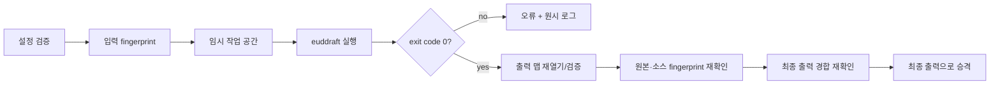

# EUD 연동

## 1. 목표

앱 안에서 epScript를 편집하고 euddraft/eudplib를 이용해 StarCraft: Remastered용 EUD 맵을 빌드한다. 컴파일러 자체를 재구현하지 않고 안정적인 어댑터를 제공한다.

초기 EUD 기능은 코드 중심이다. 시각적 블록 편집, 메모리 오프셋 탐색기, 런타임 디버거는 장기 후보로 둔다.

## 2. 외부 도구 선택

- [eudplib](https://github.com/armoha/eudplib)은 맵 열기, CHK 추출, EUD 트리거 생성과 epScript를 제공한다.
- [euddraft](https://github.com/armoha/euddraft)는 eudplib 코드와 플러그인을 맵에 적용하는 배포 도구이며 해당 fork는 StarCraft: Remastered 기능에 초점을 둔다.

초기 구현은 euddraft를 **별도 프로세스**로 실행한다. 앱과 Python 런타임을 같은 프로세스에 임베드하지 않는다.

## 3. 지원 프로필

첫 프로필은 다음과 같다.

```text
profile: scr-euddraft
game: StarCraft: Remastered
language: epScript
compiler: armoha/euddraft
input: unprotected .scm/.scx
output: a new .scx path
```

1.16.1 호환 프로필은 별도 도구와 오프셋 검증이 필요하므로 초기 범위에서 제외한다.

## 4. 작업 공간 모델

프로젝트 파일 형식이 확정되기 전까지 구현된 Application 모델은 다음 정보를
표현한다.

```text
EudBuildConfiguration
  baseMapPath
  sourceRootPath
  entrySourcePath
  outputMapPath
  compilerProfile
  compilerPathOverride?
  compilerOptions
  environmentOverrides
```

첫 `EudCompilerProfile`은 `scr-euddraft`이며 입력 맵 `.scm/.scx`, 진입 소스
`.eps`, 출력 `.scx`를 요구한다. 모델 생성 시 다음 불변식을 적용한다.

- 모든 파일과 디렉터리 경로는 drive 또는 UNC 형식의 Windows 절대 경로다.
- 장치 경로, `.`/`..`, Windows 예약 장치 이름과 금지 문자, 바깥 공백,
  끝 공백·점이 있는 세그먼트를 거부한다.
- 진입 소스는 소스 루트 내부에 있어야 한다.
- 출력 맵은 기준 맵과 다른 경로이며 소스 트리 밖에 있어야 한다.
- 컴파일러 옵션과 환경 override는 방어적으로 복사한 읽기 전용 값이다.
- 옵션 키와 환경 변수 이름/값은 설정 또는 프로세스 경계를 깨는 문자를
  거부한다.

이 검증은 파일 시스템에 접근하지 않는 어휘적 경계다. 파일 존재, 일반 파일
여부, symbolic link와 canonical 경로 동일성, 작업 중 fingerprint는
`SafeEudBuildPipeline`과 `LocalEudBuildFileGateway`가 실행 직전에 다시
검증한다. `compilerOptions`는 앱 소유 작업 공간의 `.eds` `[main]` 설정에
직렬화하며 euddraft 명령줄 인자로 직접 전달하지 않는다. 안전 파이프라인이
관리하는 `input`과 `output` 키는 사용자 옵션으로 덮어쓸 수 없다.

권장 사용자 폴더 예시:

```text
MyMap/
  base/
    MyMap.scx
  src/
    main.eps
  build/
    MyMap-eud.scx
  logs/
```

`base` 입력은 불변으로 취급한다. `build`는 재생성 가능한 출력이며 중요한 원본을 두는 위치로 사용하지 않는다.

## 5. 도구 탐색과 버전

도구 경로는 다음 우선순위로 결정한다.

1. 프로젝트에 명시된 프로필 경로
2. 사용자 설정의 euddraft 경로
3. 향후 앱과 함께 배포되는 검증된 도구

명시된 상위 우선순위 경로가 잘못되었으면 낮은 우선순위 설치로 자동
우회하지 않는다. 사용자가 의도한 도구와 다른 바이너리를 실행하는 일을 막기
위해 해당 경로의 오류를 그대로 진단한다. 경로는 공식 ZIP을 푼 디렉터리 또는
그 안의 `euddraft.exe` 절대 경로로 지정한다. `PATH` 검색은 하지 않는다.

자동으로 인터넷에서 실행 파일을 내려받아 실행하지 않는다. 앱은 사용 전에 다음을 확인한다.

- 실행 파일 또는 진입점 존재
- 버전 정보 또는 배포 식별자
- 필요한 companion 파일 존재
- 지원 프로필과의 호환성

2026-07-26 확인 기준 armoha/euddraft의 최신 공식 릴리스는
[`0.10.2.5`](https://github.com/armoha/euddraft/releases/tag/v0.10.2.5)이며
ZIP 배포 루트에는 `euddraft.exe`, `VERSION`,
`libepScriptLib.dll`, Python 런타임과 `lib/`가 함께 있다. 현재
`LocalEudToolInspector`는 도구를 실행하지 않고 다음을 정적으로 확인한다.

- `VERSION`의 최대 크기 64바이트와 정확한 4성분 버전 형식
- exact allowlist `0.10.2.5`
- 0바이트가 아닌 `euddraft.exe`
- `libepScriptLib.dll`, `python3.dll`, 버전별 `python3<runtime>.dll`
- `lib/library.zip`, `lib/eudplib.bindings._rust.pyd`, `license.txt`
- 일반 파일/디렉터리만 허용하고 symbolic link는 companion으로 인정하지 않음

다른 버전은 존재와 버전 자체는 진단할 수 있지만 빌드를 허용하지 않는다.
지원 범위를 넓힐 때에는 해당 릴리스 레이아웃과 실제 빌드 스모크 테스트를 먼저
추가한다. euddraft 소스 실행은 이 단계의 지원 설치로 취급하지 않는다.

공식 [`0.10.2.5` 진입점](https://github.com/armoha/euddraft/blob/v0.10.2.5/euddraft.py#L105-L125)은
시작할 때 자체 업데이트 검사를 호출한다. 앱이 실행 파일을 자동 다운로드하지
않는 정책과 별개로 외부 도구 자체가 네트워크와 설치 디렉터리에 접근할 수
있으므로, 빌드 확인 화면에 이 동작을 알리고 매 빌드 직전에 설치를 다시
검사한다. 향후 번들 배포는 자동 업데이트를 끄거나 격리하는 별도 정책이
필요하다.

현재 프로세스 기록은 euddraft 버전, UTC 시작·종료 시각, 종료 코드와 원시
로그를 남긴다. 출력 승격 단계의 영구 manifest에는 앱 버전, eudplib 버전과
프로필까지 추가한다.

## 6. 프로세스 경계

### 실행 규칙

- 셸을 거치지 않고 executable과 argument list를 분리해 실행한다.
- `euddraft.exe <absolute-settings.eds>` 형식의 단발 실행만 허용한다.
- 설정 파일 부모를 작업 디렉터리로 명시한다.
- stdin을 즉시 닫아 예상치 못한 입력 대기를 막는다.
- stdout과 stderr를 동시에 소비하고 UTF-8 줄 이벤트로 전달한다. 잘못된
  UTF-8 바이트는 대체 문자로 보존한다.
- 부모 환경은 Windows 실행에 필요한 allowlist만 상속하고 빌드에서 명시한
  override를 추가한다. 환경 전체를 이벤트나 진단에 기록하지 않는다.
- 각 출력 스트림은 기본 1 MiB까지만 전달한다. 초과분은 보관하지 않고
  교착 방지를 위해 끝까지 소비한 뒤 빌드를 실패시킨다.
- 앱 종료 시 실행 중인 빌드를 사용자에게 알리고 안전하게 종료한다.
- timeout, Build 취소와 스트림 구독 취소는 소유 토큰이 일치하는 프로세스만
  종료한다.

### 요청

```text
EudBuildRequest
  buildId
  tool
  settingsFilePath
  timeout
  environmentOverrides
```

### 이벤트

```text
EudBuildEvent
  started
  stdoutLine
  stderrLine
  diagnostic
  finalizing (상위 안전 파이프라인 전용)
  cancelled
  failed
  succeeded
```

요청은 절대 경로의 비어 있지 않은 일반 `.eds` 파일만 허용한다. `.edd`
데몬 모드와 `.scx` 보호 모드는 빌드 어댑터 범위 밖이며 거부한다. 실행 직전
검사된 executable도 다시 확인한다.

프로세스 로그 형식이 버전별로 달라질 수 있으므로, 아직 이해하지 못한 줄도
버리지 않는다. 종료 코드 0의 `succeeded` 이벤트는 컴파일러 프로세스 단계만
성공했다는 뜻이다. 출력 파일 존재·아카이브/CHK 검증과 최종 승격이 끝나기
전에는 전체 EUD 빌드 성공으로 표시하지 않는다.

## 7. 빌드 파이프라인



### 성공 조건

- 프로세스 종료 코드가 성공
- 임시 출력 파일이 존재하며 비어 있지 않음
- 출력 아카이브에서 CHK를 읽을 수 있음
- 최소 구조 검증 통과
- 입력 맵 fingerprint가 변경되지 않음
- 진입 epScript fingerprint가 변경되지 않음
- 기존 출력이 승인 뒤 변경·삭제되지 않았고 새 출력이 끼어들지 않음
- 최종 경로 승격 완료

어느 하나라도 실패하면 성공으로 표시하지 않는다.

### 현재 구현

`SafeEudBuildPipeline`은 `EudBuildPlan`을 받아 다음 순서를 한 스트림으로
실행한다.

1. 선택했던 euddraft executable을 `EudToolInspector`로 다시 검사한다.
2. 기준 맵·소스 루트·진입 `.eps`·출력 폴더가 symbolic link가 아닌 일반
   파일/디렉터리인지 확인하고 canonical 포함 관계를 재검사한다.
3. 기준 맵, 진입 `.eps`, 확인된 기존 출력의 fingerprint를 기록한다.
4. 최종 출력과 같은 디렉터리에
   `.starcraft_map_editor_eud_<고유 토큰>` 작업 공간을 만든다.
5. UTF-8 `build-settings.eds`에 공식 `[main] input/output`, 정렬된
   compiler option, 절대 진입 `.eps` 플러그인 섹션을 쓰고 임시
   `temporary-output.scx`를 대상으로 euddraft를 실행한다.
6. 종료 코드 0 뒤 `finalizing` 이벤트를 게시하고, 임시 출력의 존재·크기,
   MPQ의 `staredit\scenario.chk`, raw CHK 파싱과 `VER`/`DIM`/`ERA` 최소
   구조를 검사한다.
7. 입력·진입 소스·기존 출력 fingerprint와 출력 생성 경합을 다시 확인한 뒤
   검증된 임시 파일만 rename한다.
8. 모든 종료 경로에서 앱이 소유한 정확한 작업 공간만 정리하고, 그 뒤 최종
   성공·실패·취소 이벤트를 게시한다.

Windows 가짜 euddraft 통합 테스트는 이 순서를 포트별 모형으로 대체하지 않고
`EudBuildController`에서 실제 PowerShell 자식 프로세스, 생성된 UTF-8 `.eds`,
로컬 파일·SHA-256 fingerprint, 아카이브 helper와 CHK 파서, 최종 출력
rename까지 연결한다. 성공 fixture는 manifest의 절대 input/output/epScript
경로를 확인하고 기준 맵을 임시 출력으로 복사한다. 실패 fixture는 종료 코드
7과 stdout/stderr를 보존하며, 취소 fixture는 대기 중인 자식 프로세스를
종료한다. 세 시나리오는 원본 불변, 실패·취소 시 최종 출력 부재, 모든 종료
경로의 앱 소유 작업 공간 정리를 함께 검증한다.

설정 형식은 공식 euddraft의
[`readconfig.py`](https://github.com/armoha/euddraft/blob/v0.10.2.5/readconfig.py),
[`applyeuddraft.py`](https://github.com/armoha/euddraft/blob/v0.10.2.5/applyeuddraft.py)와
[`pluginLoader.py`](https://github.com/armoha/euddraft/blob/v0.10.2.5/pluginLoader.py)
계약을 따른다. 기존 출력 교체는 `EudBuildPlan.replaceExistingOutput`이
명시된 경우에만 허용한다. 교체 전 기존 파일을 최종 경로 옆의 고유
`.backup-eud-<토큰>.bak`로 옮기며, 승격 실패 시 자동 복원한다. 자동 복원도
실패하면 백업을 보존하고 복구 필요 진단에 정확한 경로를 남긴다.

## 8. 코드 편집기 MVP

필수 기능:

- 여러 `.eps` 파일 열기와 저장
- 변경 상태와 외부 변경 감지
- 줄 번호, 기본 구문 강조, 찾기/바꾸기
- 빌드 오류 클릭 시 파일/행으로 이동
- Problems와 raw Output 패널
- Build/Cancel 단축키

현재 구현된 첫 조각은 단일 `main.eps` 메모리 문서의 실제 다중행 입력,
줄 번호, 커서 위치, 맵/코드 탭 전환과 저장 기준선 기반 Clean/Modified 상태를
제공한다. `EudSourceDocument`는 immutable snapshot과 revision을 유지하고
`EudSourceController`는 같은 내용의 중복 변경을 방출하지 않으며 dirty
문서의 암묵적 교체·닫기를 막는다.

Build/Cancel 조각은 `EudBuildController`가 준비된 `EudBuildPlan` 하나를
소유하고 상위 안전 게이트웨이의 시작·원시 출력·진단·finalizing·종료
이벤트를 현재 실행 상태와 메모리 로그로 조립한다. Build가 시작되면 도구
모음 버튼이 Cancel로 바뀌고 하단 `Build Log` 탭이 자동으로 열리며 stdout과
stderr를 구분해 보여준다. euddraft 종료 뒤 검증·승격 중에는 Cancel을
비활성화하고 `finalizing` 상태를 표시한다.
실패 진단은 `Problems`에도 합쳐지고 일반 앱 작업은 `Output` 탭에 남는다.
`Ctrl+B`는 Build, `Ctrl+Shift+B`는 실행 중인 Build 취소다.

앱 부트스트랩은 실제 도구 검사, 프로세스, MPQ 재열기, fingerprint와 파일
승격 포트를 `SafeEudBuildPipeline`에 연결한다. 다만 프로젝트 설정 UI가
검사된 도구와 빌드 설정을 가진 `EudBuildPlan`을 준비하기 전에는 요청을
임의로 만들지 않으므로 Build는 비활성이다.
`EudBuildRecord`는 build ID, euddraft 버전, UTC 시작·종료 시각, 상태와 종료
코드, 캡처 시각과 채널이 붙은 stdout/stderr, 진단을 불변 값으로 보존한다.
성공은 종료 코드 0을 요구하고 실패·취소는 프로세스가 시작되지 않은 경우를
위해 종료 코드를 선택 값으로 둔다. 최근 20개 기록은 세션 메모리에서만
유지하고 새 요청을 준비해도 직전 결과를 보존한다.

빌드 출력 진단은 언어를 다시 해석하지 않고 공식 eudplib가 stderr에 출력하는
`[Error code] Module "file" Line line : message` 형식만 변환한다. 오류 번호는
안정적인 앱 진단 코드로 정규화하고 모듈 경로와 1-based 행을 보존한다. 현재
공식 형식에는 열이 없으므로 `sourceColumn`은 비워 두며, 향후 검증된 형식이
열을 제공할 때만 채운다. 변환된 위치는 Problems와 Build Log에서
`file:line[:column]`으로 표시된다.

원시 출력은 개인 경로나 토큰을 포함할 수 있으므로 자동으로 디스크에 쓰지
않는다. 영구 manifest와 개인정보 제거 보고서 내보내기는 출력 검증·승격
단계에서 경로와 사용자 동의를 함께 정의한다.

이 단계는 파일을 저장한 것처럼 표시하지 않는다. 메모리 문서는
`In-memory draft`로 표시하며 실제 `.eps` 파일 열기·저장과 외부 변경 감지는
파일 포트와 사용자 확인 흐름을 추가하는 후속 작업이다. 다중 파일, 구문 강조,
찾기/바꾸기와 오류 위치 이동도 위 MVP 완료 전에 확장한다.

초기에는 epScript를 자체 해석해 진단을 만들지 않고 euddraft가 명시적으로
보고한 빌드 오류만 변환한다. 형식이 일치하지 않는 줄은 진단으로 추측하지
않고 원시 로그에 그대로 둔다. 안정적인 언어 서버가 확인되면 자동 완성,
심볼 이동, 실시간 진단을 추가한다.

## 9. 보안 모델

euddraft 프로젝트는 Python 플러그인 또는 빌드 중 실행 가능한 코드를 포함할 수 있다. 따라서 맵이나 프로젝트를 여는 것과 빌드를 실행하는 것을 분리한다.

- 열기/미리보기만으로 코드 실행 금지
- 첫 빌드 전 실행 도구, 작업 폴더, 출력 경로 표시
- 인터넷에서 받은 프로젝트는 신뢰되지 않음 경고
- 앱 권한보다 강한 권한으로 도구 실행 금지
- 빌드 로그에 환경 변수 전체를 출력하지 않음
- 장기적으로 제한된 helper process 또는 sandbox 검토

## 10. 진단

가능하면 다음을 추출한다.

- severity
- 메시지
- 소스 파일
- 행과 열
- 컴파일 단계
- 관련 스택 또는 include/import 경로

진단 파서가 이해하지 못하는 줄도 버리지 않는다. 현재 파서는 공식 epScript
오류의 파일·행을 추출하고, 공식 형식에 없는 열은 추정하지 않는다. 사용자는
전체 stdout/stderr를 복사하거나 개인정보를 제거한 보고서로 내보낼 수 있어야
한다.

## 11. 재현성

각 빌드에 manifest를 생성할 수 있도록 모델을 준비한다.

```text
BuildManifest
  editorVersion
  compilerProfile
  compilerVersion
  baseMapHash
  sourceTreeHash
  startedAt
  finishedAt
  exitCode
  outputHash
```

시간이나 임의값을 포함하는 외부 도구 때문에 바이너리가 항상 동일하지 않을 수 있다. “재현 가능”은 우선 동일한 입력과 도구를 식별하고 결과 차이를 설명할 수 있다는 의미로 사용한다.

## 12. 테스트

- 가짜 프로세스로 성공, 실패, 취소, timeout, 잘못된 인코딩 테스트
- 공백과 한글이 포함된 경로 테스트
- 입력과 출력 경로 충돌 차단 테스트
- 종료 코드 0이지만 출력 없음, 손상 CHK, 최소 구조 누락 테스트
- 빌드 중 기준 맵·진입 소스·기존 출력 변경과 새 출력 경합 테스트
- 기존 출력 백업, 승격 실패 복원과 복원 실패 백업 보존 테스트
- 성공·실패 뒤 정확한 앱 소유 작업 공간 정리 테스트
- 실제 euddraft 버전으로 자체 제작 맵 스모크 테스트
- 출력 맵 재열기와 StarCraft 실행 수동 스모크 테스트

## 13. 미결정 사항

- euddraft 배포본을 앱에 포함할지
- 새 euddraft 릴리스를 exact allowlist에 추가하는 승인·배포 주기
- 장기 보존 프로젝트 형식과 일회성 `.eds`의 매핑 방식
- Python 플러그인을 별도 신뢰 등급으로 표시할지
- 향후 epScript 언어 서버 구현 또는 연동 방식
