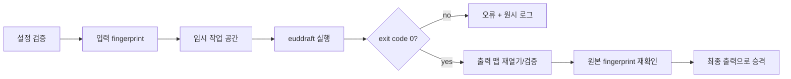

# EUD 연동

## 1. 목표

앱 안에서 epScript를 편집하고 euddraft/eudplib를 이용해 StarCraft: Remastered용 EUD 맵을 빌드한다. 컴파일러 자체를 재구현하지 않고 안정적인 어댑터를 제공한다.

초기 EUD 기능은 코드 중심이다. 시각적 블록 편집, 메모리 오프셋 탐색기, 런타임 디버거는 장기 후보로 둔다.

## 2. 외부 도구 선택

- [eudplib](https://github.com/armoha/eudplib)은 맵 열기, CHK 추출, EUD 트리거 생성과 epScript를 제공한다.
- [euddraft](https://github.com/armoha/euddraft)는 eudplib 코드와 플러그인을 맵에 적용하는 배포 도구이며 해당 fork는 StarCraft: Remastered 기능에 초점을 둔다.

초기 구현은 euddraft를 **별도 프로세스**로 실행한다. 앱과 Python 런타임을 같은 프로세스에 임베드하지 않는다.

## 3. 지원 프로필

첫 프로필은 다음과 같다.

```text
profile: scr-euddraft
game: StarCraft: Remastered
language: epScript
compiler: armoha/euddraft
input: unprotected .scm/.scx
output: a new .scx path
```

1.16.1 호환 프로필은 별도 도구와 오프셋 검증이 필요하므로 초기 범위에서 제외한다.

## 4. 작업 공간 모델

프로젝트 파일 형식이 확정되기 전까지 애플리케이션 모델은 다음 정보를 표현한다.

```text
EudProject
  baseMapPath
  sourceRoot
  entrySource
  outputMapPath
  compilerProfile
  compilerPath
  compilerOptions
  environmentOverrides
```

권장 사용자 폴더 예시:

```text
MyMap/
  base/
    MyMap.scx
  src/
    main.eps
  build/
    MyMap-eud.scx
  logs/
```

`base` 입력은 불변으로 취급한다. `build`는 재생성 가능한 출력이며 중요한 원본을 두는 위치로 사용하지 않는다.

## 5. 도구 탐색과 버전

도구 경로는 다음 우선순위로 결정한다.

1. 프로젝트에 명시된 프로필 경로
2. 사용자 설정의 euddraft 경로
3. 향후 앱과 함께 배포되는 검증된 도구

자동으로 인터넷에서 실행 파일을 내려받아 실행하지 않는다. 앱은 사용 전에 다음을 확인한다.

- 실행 파일 또는 진입점 존재
- 버전 정보 또는 배포 식별자
- 필요한 companion 파일 존재
- 지원 프로필과의 호환성

빌드 기록에는 앱 버전, euddraft/eudplib 버전, 프로필, 종료 코드를 남긴다.

## 6. 프로세스 경계

### 실행 규칙

- 셸을 거치지 않고 executable과 argument list를 분리해 실행한다.
- 작업 디렉터리를 명시한다.
- stdin 사용 여부를 명시하고 예상치 못한 입력 대기를 막는다.
- stdout과 stderr를 모두 수집한다.
- 인코딩 문제로 로그가 유실되지 않도록 원시 바이트 또는 UTF-8 변환 결과를 보존한다.
- 앱 종료 시 실행 중인 빌드를 사용자에게 알리고 안전하게 종료한다.

### 요청

```text
EudBuildRequest
  buildId
  baseMap
  sourceRoot
  entrySource
  temporaryOutput
  finalOutput
  tool
  arguments
  environment
```

### 이벤트

```text
BuildEvent
  started
  stdoutLine
  stderrLine
  diagnostic
  progress
  cancelled
  failed
  succeeded
```

프로세스 로그 형식이 버전별로 달라질 수 있으므로, 파싱된 진단과 원시 로그를 함께 유지한다.

## 7. 빌드 파이프라인



### 성공 조건

- 프로세스 종료 코드가 성공
- 임시 출력 파일이 존재하며 비어 있지 않음
- 출력 아카이브에서 CHK를 읽을 수 있음
- 최소 구조 검증 통과
- 입력 맵 fingerprint가 변경되지 않음
- 최종 경로 승격 완료

어느 하나라도 실패하면 성공으로 표시하지 않는다.

## 8. 코드 편집기 MVP

필수 기능:

- 여러 `.eps` 파일 열기와 저장
- 변경 상태와 외부 변경 감지
- 줄 번호, 기본 구문 강조, 찾기/바꾸기
- 빌드 오류 클릭 시 파일/행으로 이동
- Problems와 raw Output 패널
- Build/Cancel 단축키

초기에는 자체 파서로 잘못된 진단을 만들기보다 euddraft 결과를 신뢰한다. 안정적인 언어 서버가 확인되면 자동 완성, 심볼 이동, 실시간 진단을 추가한다.

## 9. 보안 모델

euddraft 프로젝트는 Python 플러그인 또는 빌드 중 실행 가능한 코드를 포함할 수 있다. 따라서 맵이나 프로젝트를 여는 것과 빌드를 실행하는 것을 분리한다.

- 열기/미리보기만으로 코드 실행 금지
- 첫 빌드 전 실행 도구, 작업 폴더, 출력 경로 표시
- 인터넷에서 받은 프로젝트는 신뢰되지 않음 경고
- 앱 권한보다 강한 권한으로 도구 실행 금지
- 빌드 로그에 환경 변수 전체를 출력하지 않음
- 장기적으로 제한된 helper process 또는 sandbox 검토

## 10. 진단

가능하면 다음을 추출한다.

- severity
- 메시지
- 소스 파일
- 행과 열
- 컴파일 단계
- 관련 스택 또는 include/import 경로

진단 파서가 이해하지 못하는 줄도 버리지 않는다. 사용자는 전체 stdout/stderr를 복사하거나 개인정보를 제거한 보고서로 내보낼 수 있어야 한다.

## 11. 재현성

각 빌드에 manifest를 생성할 수 있도록 모델을 준비한다.

```text
BuildManifest
  editorVersion
  compilerProfile
  compilerVersion
  baseMapHash
  sourceTreeHash
  startedAt
  finishedAt
  exitCode
  outputHash
```

시간이나 임의값을 포함하는 외부 도구 때문에 바이너리가 항상 동일하지 않을 수 있다. “재현 가능”은 우선 동일한 입력과 도구를 식별하고 결과 차이를 설명할 수 있다는 의미로 사용한다.

## 12. 테스트

- 가짜 프로세스로 성공, 실패, 취소, timeout, 잘못된 인코딩 테스트
- 공백과 한글이 포함된 경로 테스트
- 입력과 출력 경로 충돌 차단 테스트
- 실패한 임시 출력이 최종 파일이 되지 않는 테스트
- 실제 euddraft 버전으로 자체 제작 맵 스모크 테스트
- 출력 맵 재열기와 StarCraft 실행 수동 스모크 테스트

## 13. 미결정 사항

- euddraft 배포본을 앱에 포함할지
- 지원할 최소/최대 euddraft 버전
- 설정 파일을 직접 생성할지 기존 프로젝트 형식을 사용할지
- Python 플러그인을 별도 신뢰 등급으로 표시할지
- 향후 epScript 언어 서버 구현 또는 연동 방식
